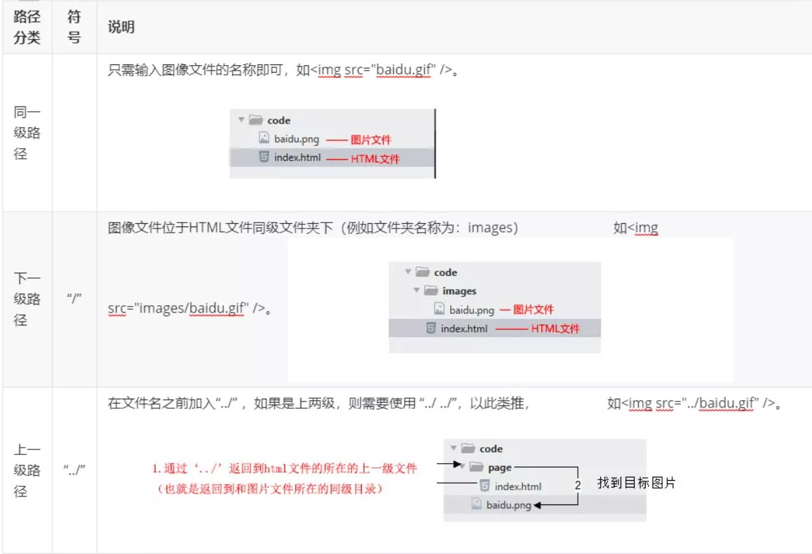
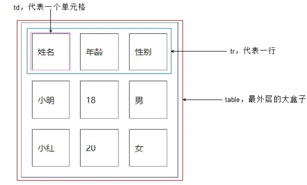
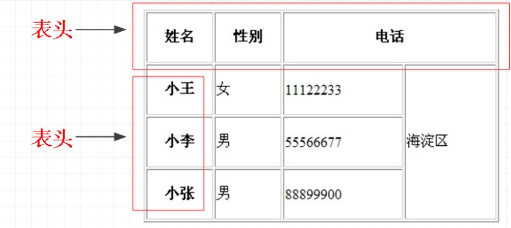
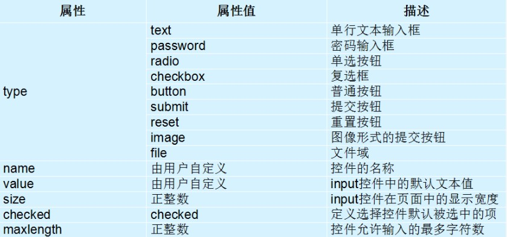

# **HTML基础**


## HTML介绍


### 概述

（Hyper Text Markup Language):超文本标记语言

所谓超文本，有2层含义：

+ 因为它可以加入图片、声音、动画、多媒体等内容（超越文本限制 ）

+ 不仅如此，它还可以从一个文件跳转到另一个文件，与世界各地主机的文件连接（超级链接文本）


### 基本骨架

```html
<!-- 页面中最大的标签 根标签 -->
<html>
    <!-- 头部标签 -->
    <head>     
        <!-- 标题标签 -->
        <title></title> 
    </head>
    <!-- 文档的主体 -->
    <body>
    </body>
</html>
```


###  团队约定大小写

+ HTML标签名、类名、标签属性和大部分属性值统一用小写


### HTML元素标签分类

- 常规元素(双标签)

- 空元素(单标签)

  ```html
   <!-- 常规元素(双标签) -->
    <标签名> 内容 </标签名>   
    <body>我是文字</body>
  
   <!--  空元素(单标签) -->
    <标签名 />  
    <br />或<br>
  ```

  

### HTML标签关系

- 嵌套关系父子级包含关系
- 并列关系兄弟级并列关系
- 如果两个标签之间的关系是嵌套关系，子元素最好缩进一个tab键的身位（一个tab是4个空格）。如果是并列关系，最好上下对齐。


##  HTML常用标签


###  排版标签

- 标题标签h(h1~h6)
- 段落标签p,可以把 HTML 文档分割为若干段落
- 水平线标签hr
- 换行标签br
- div和span标签:是没有语义的,是我们网页布局最主要的2个盒子。
- b和strong 文字以粗体显示
- i和em 文字以斜体显示
- s和del 文字以加删除线显示
- u和ins 文字以加下划线显示

h1=32px
h2=24px
h3=18.72px
h4=16px
p=16px
h5=13.28px
h6=12px

###  标签属性（行内式）

使用HTML制作网页时，如果想让HTML标签提供更多的信息，可以使用HTML标签的属性加以设置。

```html
<标签名 属性1="属性值1" 属性2="属性值2" …> 内容 </标签名>
<手机 颜色="红色" 大小="5寸"> 内容 </手机>
```


###   图像标签img

 

|  属性  | 属性值 |          描述          |
| :----: | :----: | :--------------------: |
|  src   |  URL   |       图像的路径       |
|  alt   |  文本  | 图像不能显示时替换文本 |
| title  |  文本  |  鼠标悬停时显示的内容  |
| width  |  像素  |     设置图像的宽度     |
| height |  像素  |     设置图像的高度     |
| boeder |  数字  |   设置图像边框的宽度   |

**注意：**

- 标签可以拥有多个属性，必须写在开始标签中，位于标签名后面。
- 属性之间不分先后顺序，标签名与属性、属性与属性之间均以空格分开。
- **注意：**
  - 标签可以拥有多个属性，必须写在开始标签中，位于标签名后面。
  - 属性之间不分先后顺序，标签名与属性、属性与属性之间均以空格分开。
  - 采取  键值对 的格式  key="value"  的格式，即属性=“属性值”。

```html

```


###  链接标签

``` html
<a href="跳转目标" target="目标窗口的弹出方式">文本或图像</a>
```

| 属性   | 作用                                                         |
| :----- | :----------------------------------------------------------- |
| href   | 用于指定链接目标的url地址，（必须属性）当为标签应用href属性时，它就具有了超链接的功能 |
| target | 用于指定链接页面的打开方式，其取值有\_ self和 \_ blank两种，其中\_ self为默认值，\_ blank为在新窗口中打开方式。 |

**src 和 href 的区别**

一句话概括:**src 是引入资源的 href 是跳转url的**

1. src用于替换当前元素，href用于在当前文档和引用资源之间确立联系。
2. src是source的缩写，指向外部资源的位置，指向的内容将会嵌入到文档中当前标签所在位置；在请求src资源时会将其指向的资源下载并应用到文档内，例如js脚本，img图片和frame等元素。当浏览器解析到该元素时，会暂停其他资源的下载和处理，直到将该资源加载、编译、执行完毕，图片和框架等元素也如此，类似于将所指向资源嵌入当前标签内。这也是为什么将js脚本放在底部而不是头部。
3. href是Hypertext Reference的缩写，指向网络资源所在位置，建立和当前元素（锚点）或当前文档（链接）之间的链接。如果我们在文档中添加那么浏览器会识别该文档为css文件，就会并行下载资源并且不会停止对当前文档的处理。这也是为什么建议使用link方式来加载css，而不是使用@import方式。

**注意：**

1. 外部链接 需要添加 **http:// www.**baidu.com
2. 内部链接 直接链接内部页面名称即可 比如 < a href="index.html"> 首页
3. 如果当时没有确定链接目标时，通常将链接标签的href属性值定义为“#”(即href="#")，表示该链接暂时为一个空链接。
4. 不仅可以创建文本超链接，在网页中各种网页元素，如图像、表格、音频、视频等都可以添加超链接。


####  锚点定位

通过创建锚点链接，用户能够快速定位到目标内容

1. 使用相应的id名标注跳转目标的位置。 (找目标)

``` html
<h3 id="two">第2集</h3> 
```

2.使用<a href="#id名"></a>创建链接文本（被点击的） 

``` html
<a href="#two">链接文本</a>
```


###  注释标签

``` html
<!-- 注释语句 -->    
```

快捷键是：  **ctrl + /**    或者 **ctrl +shift + /**

**团队约定：**注释内容前后各一个空格字符，注释位于要注释代码的上面，单独占一行


###  路径



### 特殊字符


## 表格


### 概述

现在还是较为常用的一种标签，但不是用来布局，常见显示、展示表格式数据。因为它可以让数据显示的非常的规整，可读性非常好。特别是后台展示数据的时候表格运用是否熟练就显得很重要，一个清爽简约的表格能够把繁杂的数据表现得很有条理。


###  创建表格

``` html
<table>
  <tr>
    <td>单元格内的文字</td>
    ...
  </tr>
  ...
</table>
```

table、tr、td，他们是创建表格的基本标签，缺一不可

- table用于定义一个表格标签。
- tr标签 用于定义表格中的行，必须嵌套在 table标签中。
- td 用于定义表格中的单元格，必须嵌套在<tr></tr>标签中。
- 字母 td 指表格数据（table data），即数据单元格的内容，现在我们明白，表格最合适的地方就是用来存储数据的。td像一个容器，可以容纳所有的元素。



**表头单元格标签th**:一般表头单元格位于表格的第一行或第一列，并且文本加粗居中,只需用表头标签<th></th>替代相应的单元格标签<td></td>即可。



**表格标题caption ** 通常这个标题会被居中且显示于表格之上。caption 标签必须紧随 table 标签之后。这个标签只存在表格里面才有意义。

```html
<table>
   <caption>我是表格标题</caption>
</table>
```


### 表格属性

|    属性     |                   含义                   |     常用属性值      |
| :---------: | :--------------------------------------: | :-----------------: |
|   border    |   设置表格边框（默认border=“0”无边框）   |       像素值        |
| cellspacing |   设置单元格与单元格边框之间的空白间距   |  像素值（默认2px）  |
| cellpadding | 设置单元格内容与单元格边框之间的空白边距 |  像素值（默认1px）  |
|    width    |              设置表格的宽度              |       像素值        |
|   height    |              设置表格的高度              |       像素值        |
|    align    |      设置表格在网页中的水平对齐方式      | left，right，center |

三参为0，平时开发的我们这三个参数   border  cellpadding  cellspacing 为  0


### 合并单元格

合并的顺序我们按照  先上 后下   先左  后右 的顺序 ,合并完之后需要删除多余的单元格。

- 跨行合并：rowspan="合并单元格的个数"
- 跨列合并：colspan="合并单元格的个数"


### 表格标签总结

|       标签名        |      定义      |                     说明                     |
| :-----------------: | :------------: | :------------------------------------------: |
|   <table></table>   |    表格标签    |              就是一个四方的盒子              |
|      <tr></tr>      |   表格行标签   |       行标签要再table标签内部才有意义        |
|      <td></td>      |   单元格标签   |   单元格标签是个容器级元素，可以放任何东西   |
|      <th></th>      | 表头单元格标签 | 它还是一个单元格，但是里面的文字会居中且加粗 |
| <caption></caption> |  表格标题标签  |  表格的标题，跟着表格一起走，和表格居中对齐  |
| clospan 和 rowspan  |    合并属性    |               用来合并单元格的               |


### 表格结构标签

 对于比较复杂的表格，表格的结构也就相对的复杂了，所以又将表格分割成三个部分：题头、正文和脚注。而这三部分分别用:thead,tbody,tfoot来标注， 这样更好的分清表格结构。

**注意：**
1.<thead></thead>：用于定义表格的头部。用来放标题之类的东西。<thead> 内部必须拥有<tr> 标签！

2.<tbody></tbody>：用于定义表格的主体。放数据本体 。

3.<tfoot></tfoot>放表格的脚注之类。

4.以上标签都是放到table标签中。


## 列表

容器里面装载着结构，样式一致的文字或图表的一种形式，叫列表。

列表最大的特点就是整齐 、整洁、 有序，跟表格类似，但是它可组合自由度会更高。

### 无序列表

- <ul></ul>中只能嵌套<li></li>，直接在<ul></ul>标签中输入其他标签或者文字的做法是不被允许的。
- <li>与</li>之间相当于一个容器，可以容纳所有元素

~~~ html
<ul>
  <li>列表项1</li>
  <li>列表项2</li>
  <li>列表项3</li>
  ......
</ul>
~~~


### 有序列表

- <ol>标签中的type属性值为排序的序列号，不添加type属性时，有序列表默认从数字1开始排序。

- 常用的type属性值分别为是1，a，A，i，I

- <ol reversed="reversed">中的reversed属性能够让有序列表中的序列倒序排列。

- <ol start="3">中的start属性值为3，有序列表中的第一个序列号将从3开始排列。

~~~ html
<ol type="A"> 
  <li>列表项1</li>
  <li>列表二</li>
  <li>列表三</li>
</ol>
~~~


### 自定义列表

定义列表常用于对术语或名词进行解释和描述，定义列表的列表项前没有任何项目符号。

~~~ html
<dl>
  <dt>名词1</dt>
  <dd>名词1解释1</dd>
  <dd>名词1解释2</dd>
  ...
  <dt>名词2</dt>
  <dd>名词2解释1</dd>
  <dd>名词2解释2</dd>
  ...
</dl>
~~~


## 表单

在HTML中，一个完整的表单通常由**表单控件（也称为表单元素）**、**提示信息**和**表单域**3个部分构成。表单目的是为了收集用户信息。

+ **表单控件：**
   包含了具体的表单功能项，如单行文本输入框、密码输入框、复选框、提交按钮、重置按钮等。

+ **提示信息：**
   一个表单中通常还需要包含一些说明性的文字，提示用户进行填写和操作

+ **表单域：** 
   它相当于一个容器，用来容纳所有的表单控件和提示信息，可以通过他定义处理表单数据所用程序的url地址，以及数据提交到服务器的方法。如果不定义表单域，表单中的数据就无法传送到后台服务器。

  

### input控件

~~~html
<input type="属性值" value="你好">
~~~

- input 输入的意思
- <input />标签为单标签
- type属性设置不同的属性值用来指定不同的控件类型
- 除了type属性还有别的属性

**常用属性：**



~~~ html
用户名: <input type="text" /> 
密  码：<input type="password" />
~~~


#### value属性

value 默认的文本值。有些表单想刚打开页面就默认显示几个文字，就可以通过这个value 来设置。

~~~html
用户名:<input type="text"  name="username" value="请输入用户名"> 
~~~


#### name属性

- name表单的名字， 这样，后台可以通过这个name属性找到这个表单。 页面中的表单很多，name主要作用就是用于区别不同的表单。

- - name属性后面的值，是我们自己定义的。
  - radio  如果是一组，我们必须给他们命名相同的名字 name  这样就可以多个选其中的一个了。

~~~html
<input type="radio" name="sex"  />男
<input type="radio" name="sex" />女
~~~


#### checked属性

表示默认选中状态。 较常见于 单选按钮和复选按钮。

~~~html
性    别:
<input type="radio" name="sex" value="男" checked="checked" />男
<input type="radio" name="sex" value="女" />女 
~~~


#### input 属性小结

| 属性    | 说明     | 作用                                                   |
| :------ | :------- | :----------------------------------------------------- |
| type    | 表单类型 | 用来指定不同的控件类型                                 |
| value   | 表单值   | 表单里面默认显示的文本                                 |
| name    | 表单名字 | 页面中的表单很多，name主要作用就是用于区别不同的表单。 |
| checked | 默认选中 | 表示那个单选或者复选按钮一开始就被选中了               |


### label标签

- label 标签为 input 元素定义标注（标签）。
- label标签主要目的是为了提高用户体验。为用户提高最优秀的服务。

**作用：**用于绑定一个表单元素, 当点击label标签的时候, 被绑定的表单元素就会获得输入焦点。

**如何绑定元素呢**

- 第一种用法就是用label标签直接包含input表单， 适合单个表单选择
- 第二种用法 for 属性规定 label 与哪个表单元素绑定(通过id)。

~~~html
第一种
  <label> 用户名： 
    <input type="radio" name="usename" value="请输入用户名">   
  </label>
  
  第二种
  <label for="sex">男</label>
  <input type="radio" name="sex"  id="sex">
~~~


### textarea控件（文本域）

- 通过textarea控件可以轻松地创建多行文本输入框.
- cols="每行中的字符数" rows="显示的行数"  我们实际开发不用

~~~ html
 <textarea >
    文本内容
  </textarea>
~~~


**文本框和文本域区别**

|       表单        |  名称  |       区别       |         默认值显示          |       用于场景       |
| :---------------: | :----: | :--------------: | :-------------------------: | :------------------: |
| input type="text" | 文本框 | 只能显示一行文本 | 单标签，通过value显示默认值 | 用户名、昵称、密码等 |
|     textarea      | 文本域 | 可以显示多行文本 | 双标签，默认值写到标签中间  |        留言板        |


### select下拉列表

- 如果有多个选项让用户选择，为了节约空间，我们可以使用select控件定义下拉列表。
- 在option 中定义selected =" selected "时，当前项即为默认选中项。
- 实际开发会用的比较少

~~~html
<select>
  
  <option>选项1</option>
  <option>选项2</option>
  <option>选项3</option>
  ...
</select>
~~~


### form表单域

- 收集的用户信息怎么传递给服务器？

- - 通过form表单域

- 目的：

- - 在HTML中，form标签被用于定义表单域，以实现用户信息的收集和传递，form中的所有内容都会被提交给服务器

~~~html
<form action="url地址" method="提交方式" name="表单名称">
  各种表单控件
</form>
~~~

**常用属性：**

- 每个表单都应该有自己表单域。后面学 ajax 后台交互的时候，必须需要form表单域。

| 属性   | 属性值   | 作用                                               |
| :----- | :------- | :------------------------------------------------- |
| action | url地址  | 用于指定接收并处理表单数据的服务器程序的url地址。  |
| method | get/post | 用于设置表单数据的提交方式，其取值为get或post。    |
| name   | 名称     | 用于指定表单的名称，以区分同一个页面中的多个表单。 |


## 增加

### input的placeholder属性

placeholder 属性规定可描述输入字段预期值的简短的提示信息（比如：一个样本值或者预期格式的短描述）。

该提示会在用户输入值之前显示在输入字段中。

**注意：**placeholder 属性适用于下面的 input 类型：text、search、url、tel、email 和 password。


### 标签

<sup> 标签定义上标文本。上标文本将会显示在当前文本流中字符高度的一半为基准线的上方，但是与当前文本流中文字的字体和字号都是一样的。上标文本能用来添加脚注，比如 WWW[1]。


<sub> 标签定义下标文本。下标文本将会显示在当前文本流中字符高度的一半为基准线的下方，但是与当前文本流中文字的字体和字号都是一样的。下标文本能用来表示化学公式，比如 H2O。