#  JavaScript基础


## 编程基础

### 编程基础

**「计算机语言」**分为机器语言，汇编语言，高级语言。计算机内部最终执行的都是机器语言，由`0`和`1`这样的二进制数构成。

**「数据存储单位」**8bit(比特) = 1B(Byte)字节  千字节1KB = 1024B

**「翻译器」**高级语言编写的程序不能被计算机识别，需要经过转换，将源代码程序翻译成`机器语言`才能运行。浏览器里面的js解释器就是这样的一个翻译器。

**「程序运行」**

- 打开某个程序时，先从硬盘中把程序的代码加载到内存中
- CPU执行内存中的代码
- 注意：之所以要内存的一个重要原因，是因为 cpu运行太快了，如果只从硬盘中读数据，会浪费cpu性能，所以，才使用存取速度更快的内存来保存运行时的数据。（内存是电，硬盘是机械）

### 初识JavaScript

**「创始人」**布兰登·艾奇(Brendan Eich),起初命名为`LiveScript`后来与Sun公司合作改名为`JavaScript`。

**「JavaScript」**运行在客户端的脚本语言，不需要编译，由js解释器(js引擎)逐行解释执行。Node.js也可以用于服务器端编程。

**「JavaScript组成」**ECMAScript(JavaScript语法)、DOM(文档对象模型)、BOM(浏览器对象模型)

```
JavaScript的作用
```

- 表单动态校验(密码强度检测)
- 网页特效
- 服务端开发(Node.js)
- 桌面程序(Electron)、App(Cordova)、控制硬件-物联网(Ruff)、游戏开发(cocos2d-js)

**「JavaScript书写位置」**

> JS有3种书写位置，分别为行内、内嵌和外部。

1. 行内式

```javascript
<input type="button" value="点我试试" 
onclick="alert('Hello World')" />
```

1. 内嵌式

```javascript
<script>
    alert('Hello  World~!');
</script>
```

1. 外部式

```javascript
引用外部js文件
<script src = "my.js"></script>
```

**「注释」**

1. 单行注释

```javascript
// 单行注释 (快捷键 ctrl + / )
```

1. 多行注释

```javascript
/*
  点击vscode左下角管理-键盘快捷方式-切换块注释
  (默认快捷键 alt + shift + a) 修改为 (ctrl + shift + /)
*/
```

## 变量

### 变量的概念

**「变量」**是程序在内存中申请的一块用于存放数据的空间。变量是用于存放数据的容器，可以通过变量名获取数据，甚至修改数据。

### 变量的使用

**「1. 声明变量」**

```javascript
// 1.声明变量
var num; // 声明一个 名称为 num 的变量
```

var是一个JS关键字，用来声明变量(variable变量的意思)。num是我们定义的变量名，可以通过变量名来访问内存中分配的空间。

**「2. 赋值」**

```javascript
num = 10;//给 num 这个变量赋值为 10
```

**「3. 变量的初始化」**

声明一个变量并赋值， 我们称之为变量的初始化。

```javascript
var num = 10;//声明变量并赋值为10 
```

**「4. 变量语法扩展」**

```javascript
// 1.一个变量被重新赋值后，它原有的值会被覆盖掉，变量值以最后一次赋的值为准。
var num = 10;
num = 11;
// 2.同时声明多个变量(只需要写一个var,多个变量名之间用英文逗号隔开)
var num = 10, age = 15, name = 'fan';
```

声明变量特殊情况

|             情况              |          说明           |   结果    |
| :---------------------------: | :---------------------: | :-------: |
| var  age ; console.log (age); |      只声明 不赋值      | undefined |
|       console.log(age)        | 不声明 不赋值  直接使用 |   报错    |
| age  = 10; console.log (age); |     不声明  只赋值      |    10     |

**「5. 变量命名规范」**


## 数据类型

分为两类：简单数据类型(Number,String,Boolean,Undefined,Null)和复杂数据类型(object)。

| 简单数据类型 | 说明                                             | 默认值    |
| :----------- | :----------------------------------------------- | :-------- |
| Number       | 数字型,包含整型值和浮点型值                      | 0         |
| String       | 字符串型                                         | ""        |
| Boolean      | 布尔值型                                         | false     |
| Undefined    | var a;声明了变量a但是没有赋值，此时a = undefined | undefined |
| Null         | var a = null;声明了变量a为空值                   | null      |

### Number数字型

**「数字型进制」**

```
// 1.在JS中八进制前面加0，十六进制前面加 0x
var num1 = 07;   // 对应十进制的7
// 2.十六进制数字序列范围：0~9以及A~F
 var num = 0xA;   
```

**「数字型范围」**JavaScript中的数值有最大值和最小值

- 最大值:`Number.MAX_VALUE`，值为：1.7976931348623157e+308
- 最小值:`Number.MIN_VALUE`，值为：5e-32
- 特殊值：`Infinity` 无穷大 `-Infinity` 无穷小 `NaN` 代表一个非数字
- isNaN():用来判断一个变量是否为非数字的类型。非数字型为true,数字型为false。

### String字符串型

```javascript
// 1.字符串型可以是引号中的任意文本，语法为 单引号 和 双引号
var msg = '我的名字叫';
var name = "fan";
```

**「1. 字符串转义符」**都是以 \ 开头，详细如下👇👇

| 转义符 | 说明                       |
| :----- | :------------------------- |
| \n     | 换行符，n是 newline 的意思 |
| \\     | 斜杆 \                     |
| \'     | 单引号 ‘                   |
| \"     | 双引号 "                   |
| \t     | tab 缩进                   |
| \b     | 空格,b是 blank 的意思      |

**「2. 字符串长度」**
  字符串是由若干字符组成的，这些字符的数量就是字符串的长度。

```javascript
// 1.字符串型可以是引号中的任意文本，语法为 单引号 和 双引号
var msg = '我是帅气的饭老板';
console.log(msg.length); // 显示 8
```

**「3. 字符串拼接」**
  多个字符串之间可以使用 + 进行拼接，其拼接方式为 字符串 + 任何类型 = 拼接之后的新字符串。
  拼接前会把与字符串相加的任何类型转成字符串，再拼接成一个新的字符串

```javascript
//1.1 字符串 "相加"
alert('hello' + ' ' + 'world'); // hello world
//1.2 数值字符串 "相加"
alert('100' + '100'); // 100100
//1.3 数值字符串 + 数值
alert('11' + 12);     // 1112 +号口诀：数值相加，字符相连
// 1.4 字符串拼接加强
var age = 18;
alert("饭老板今年" + age +"岁了");
```

### 布尔型Boolean

  布尔类型有两个值：true 和 false ，其中 true 表示真（对），而 false 表示假（错）。
  布尔型和数字型相加的时候， true 的值为 1 ，false 的值为 0。

```javascript
console.log(true + 1) // 2
console.log(false + 1) // 1
```

### Undefined 和 Null

  一个变量声明后没有赋值会有一个默认值undefined(如果相连或者相加时，注意结果)

```javascript
  var variable;
  console.log(variable); // undefined
  console.log("你好" + variable); // 你好undefined
  console.log(11 + variable); // NaN
  console.log(true + variable);// NaN
```

  一个变量声明并赋值null,里面存的值为空

```javascript
  var var2 = null;
  console.log(var2); // null
  console.log("你好" + var2); // 你好null
  console.log(11 + var2); // 11
  console.log(true + var2);// 1
```

### 获取变量类型及转换

- 检测变量的数据类型 `typeof`

```javascript
  var num = 10;
  console.log(typeof num)//结果为 number
```

- `字面量`:是源代码中一个固定值的表示法，就是字面量如何去表达这个值。通过数据的格式特征可以判断数据的类型

- - 有数字字面量:8,9,10
  - 字符串字面量:'饭老板'，"前端开发"
  - 布尔字面量:true,false

**「数据类型转换」**

- 转换为字符串

| 方式               | 说明                         | 案例                               |
| :----------------- | :--------------------------- | :--------------------------------- |
| toString()         | 转成字符串                   | var num=1; alert(num.toString())   |
| String()           | 强制转换                     | var num=1; alert(String(num))      |
| **加号拼接字符串** | 和字符串拼接的结果都是字符串 | var num=1; alert(num+'我是字符串') |


- 转换为数字型

| 方式                     | 说明                         | 案例               |
| :----------------------- | :--------------------------- | :----------------- |
| parseInt(String)函数     | 将string类型转成整数型       | parseInt('11')     |
| parseFloat(String)函数   | 将string类型转成浮点型       | parseFloat('11.2') |
| Number() 强制转换函数    | 将string类型强制转换为数值型 | Number('12')       |
| **js隐式转换 ( - \* /)** | 利用算数运算隐式转换为数值型 | '12' - 0           |


- 转换为布尔型
  代表空、否定的值会被转换为false，如''、0、NaN、null、undefined 其余值都会被转换为true

| 方式      | 说明                 | 案例            |
| :-------- | :------------------- | :-------------- |
| Boolean() | 其他类型转换为布尔值 | Boolean('true') |

### 关键字和保留字

**「标识符」**指开发人员为变量、属性、函数、参数取得名字。标识符不能是关键字或保留字。

**「关键字」**指 JS本身已经使用了的字，不能再用它们充当变量名、方法名

> 包括：break、case、catch、continue、default、delete、do、else、finally、for、function、if、in、instanceof、new、return、switch、this、throw、try、typeof、var、void、while、with 等。

**「保留字」**实际上就是预留的“关键字”，意思是现在虽然还不是关键字，但是未来可能会成为关键字，同样不能使用它们当变量名或方法名。

> boolean、byte、char、class、const、debugger、double、enum、export、extends、fimal、float、goto、implements、import、int、interface、long、mative、package、private、protected、public、short、static、super、synchronized、throws、transient、volatile 等。
>
> 注意：如果将保留字用作变量名或函数名，那么除非将来的浏览器实现了该保留字，否则很可能收不到任何错误消息。当浏览器将其实现后，该单词将被看做关键字，如此将出现关键字错误。

------

## 运算符与流程控制

### 运算符(操作符)

**「运算符」**是用于实现赋值、比较和执行算数运算等功能的符号。常用运算符分类如下👇

- 算数运算符
- 递增和递减运算符
- 比较运算符
- 逻辑运算符
- 赋值运算符

**「算数运算符」**

| 运算符 | 描述       | 案例                |
| :----- | :--------- | :------------------ |
| +      | 加         | 10+20=30            |
| -      | 减         | 10-20=-10           |
| *      | 乘         | 10*20=200           |
| /      | 除         | 10/20=0.5           |
| %      | 取余(取模) | 返回除法的余数9%2=1 |

- 浮点数的精度问题

  ```javascript
    var result = 0.1 + 0.2;    // 结果不是 0.3，而是：0.30000000000000004
    console.log(0.07 * 100);   // 结果不是 7，  而是：7.000000000000001
  ```

- - 浮点数值的最高精度是17位小数，但是在进行算数运算时其精确度远远不如整数,所以不要直接判断两个浮点数是否相等!

- 表达式与返回值

- - 表达式：由数字、运算符和变量组成的式子。
  - 返回值：每一个表达式经过相应的运算之后，会有一个最终结果，称为表达式的返回值

**「递增和递减运算符」**

  递增和递减运算符必须配合变量使用。

- 递增运算符

```javascript
  var  num = 10;
  alert(++num + 10);   // 21 使用口诀：先自加，后返回值
  
  var  num1 = 10;
  alert(10 + num1++);  // 20 使用口诀：先返回原值，后自加 
  var num = 1;
  var num2 = ++num + num++; //num = 2
  console.log(num2);//4
  
  var num = 1;
  var num1 = 1;
  var num2 = num++ + num1++; // 1 + 1
  console.log(num2);//2
  
  var num = 1;
  var num2 = num++ + num++;// 1 + 2 
  console.log(num2); // 3  
  
```

**「比较运算符」**

|  运算符  | 描述                                | 案例        | 结果  |
| :------: | :---------------------------------- | :---------- | :---- |
|    <     | 小于号                              | 1<2         | true  |
|    >     | 大于号                              | 1>2         | false |
|    >=    | 大于等于号(大于或者等于)            | 2 >= 2      | true  |
|    <=    | 小于等于号(小于或者等于)            | 3 <= 2      | false |
|    ==    | 判等号(会转型)                      | 15 == '15'  | true  |
|    !=    | 不等号                              | 37 != 37    | false |
| === !=== | 全等 全不等(要求值和数据类型都一致) | 37 === '37' | false |

**「逻辑运算符」**
  逻辑运算符是用来进行布尔值运算的运算符
  短路运算:当有多个表达式（值）时,左边的表达式值可以确定结果时,就不再继续运算右边的表达式的值;

| 运算符 | 描述                  | 案例          | 特点                     |
| :----: | :-------------------- | :------------ | :----------------------- |
|   &&   | "逻辑与",简称"与" and | true && false | 两边都是 true才返回 true |
|  \|\|  | "逻辑或",简称"或" or  | true          | 有真为真                 |
|   !    | "逻辑非",简称"非" not | !true         | 取反                     |

**「赋值运算符」**

|  运算符  | 描述                 | 案例                 |
| :------: | :------------------- | :------------------- |
|    =     | 直接赋值             | var userName = 'fan' |
|  += -=   | 加减一个数后再赋值   | var age=5; age+=5    |
| *= /= %= | 乘、除、取模后再赋值 | var age=5; age*=5    |

**「运算符优先级」**

| 优先级 | 运算符     | 顺序          |
| :----: | :--------- | :------------ |
|   1    | 小括号     | ()            |
|   2    | 一元运算符 | ! ++ --       |
|   3    | 算数运算符 | 先* / % 后+ - |
|   4    | 关系运算符 | > >= < <=     |
|   5    | 相等运算符 | == != === !== |
|   6    | 逻辑运算符 | 先&& 后\|\|   |
|   7    | 赋值运算符 | =             |
|   8    | 逗号运算符 | ,             |

### 流程控制

**「流程控制」**在一个程序执行的过程中，各条代码的执行顺序对程序的结果是有直接影响的。很多时候我们要通过控制代码的执行顺序来实现我们要完成的功能。流程控制主要有三种结构，分别是**顺序结构**、**分支结构**和**循环结构**，代表三种代码执行的顺序。

**「分支流程控制」**

```javascript
  // 1. 条件成立执行的代码语句
  if (条件表达式) { 
  }
  
  // 2.if else 语句
  if (条件表达式) {
      // [如果] 条件成立执行的代码
  } else {
      // [否则] 执行的代码
  }
  
  // 3. if else if 语句(多分支语句)
  // 适合于检查多重条件。
  if (条件表达式1) {
      语句1；
  } else if (条件表达式2)  {
      语句2；
  } else if (条件表达式3)  {
     语句3；
   ....
  } else {
    // 上述条件都不成立执行此处代码
}
```

**「三元表达式」**

```javascript
  //如果表达式1为 true ，则返回表达式2的值，如果表达式1为 false，则返回表达式3的值
  表达式1 ? 表达式2 : 表达式3;
```

**「switch分支流程控制」**它用于基于不同的条件来执行不同的代码。当要针对变量设置一系列的特定值的选项时，就可以使用 switch。

```javascript
  switch( 表达式 ){ 
      case value1:
          // 表达式 等于 value1 时要执行的代码
          break;
      case value2:
          // 表达式 等于 value2 时要执行的代码
          break;
      default:
          // 表达式 不等于任何一个 value 时要执行的代码
  }
```

## 循环与代码规范

### 循环

| 运算符     | 描述                                                         |
| :--------- | :----------------------------------------------------------- |
| 初始化变量 | 通常被用于初始化一个计数器,该表达式可以使用var关键字声明新的变量，这个变量帮我们来记录次数。 |
| 条件表达式 | 用于确定每一次循环是否能被执行，如果结果是true就继续循环，否则退出循环 |
| 操作表达式 | 每次循环的最后都要执行的表达式。通常用于更新计数器变量的值   |

```javascript
  for(初始化变量; 条件表达式; 操作表达式 ){
    //循环体
}
```

**「执行流程」**

1. 初始化变量，初始化操作在整个 for 循环只会执行一次。
2. 执行条件表达式，如果为true，则执行循环体语句，否则退出循环，循环结束。
3. 执行操作表达式,此时第一轮结束。
4. 第二轮开始，直接去执行条件表达式（不再初始化变量），如果为 true ，则去执行循环体语句，否则退出循环。
5. 继续执行操作表达式，第二轮结束。......

**「双重for循环」**循环嵌套是指在一个循环语句中再定义一个循环语句的语法结构，例如在for循环语句中，可以再嵌套一个for 循环，这样的 for 循环语句我们称之为双重for循环。

```javascript
  for (外循环的初始; 外循环的条件; 外循环的操作表达式) {
    for (内循环的初始; 内循环的条件; 内循环的操作表达式) {  
       需执行的代码;
   }
}
//for循环打印九九乘法表
  var str = "";
  for (var i = 1; i <= 9; i++) {
    for (var j = 1; j <= i; j++) {
      str += j + "x" + i + "=" + j * i + "\t";
    }
    str += "\n";
  }
  console.log(str);
```

**「while循环」**

```javascript
  while (条件表达式) {
      // 循环体代码 
  }
  // 1. 先执行条件表达式，如果结果为 true，则执行循环体代码；
  //    如果为 false，则退出循环，执行后面代码
  // 2. 执行循环体代码
  // 3.  循环体代码执行完毕后，程序会继续判断执行条件表达式，
  //计算1-100的累加和
    var i = 1;
    var sum = 0;
    while (i <= 100) {
      sum += i;
      i++;
    }
    console.log(sum);
```

**「do-while循环」**

```javascript
do {
    // 循环体代码 - 条件表达式为 true 时重复执行循环体代码
} while(条件表达式);
    // 先执行一次循环体代码，再执行条件表达式
    //计算100以内的偶数累加和
      var i = 1;
      var sum = 0;
      do {
        if (i % 2 == 0) {
          sum += i;
        }
        i++;
      } while (i <= 100);
      console.log(sum);
```

**「continue、break」**
  `continue` 关键字用于立即跳出本次循环，继续下一次循环（本次循环体中 continue 之后的代码就会少执行一次）。
  `break` 关键字用于立即跳出整个循环（循环结束）。

### 代码规范

```javascript
1. 标识符命名规范
```

- 变量、函数的命名必须要有意义
- 变量的名称一般用名词
- 函数的名称一般用动词

```javascript
2. 操作符规范
// 操作符的左右两侧各保留一个空格
for (var i = 1; i <= 5; i++) {
  if (i == 3) {
      break; // 直接退出整个 for 循环，跳到整个for循环下面的语句
  }
  console.log('我正在吃第' + i + '个包子呢');
}
3. 单行注释规范
 for (var i = 1; i <= 5; i++) {
  if (i == 3) {
      break; // 单行注释前面注意有个空格
  }
  console.log('我正在吃第' + i + '个包子呢');
}
4. 其他规范
//关键词 操作符空格
if (true) {}
for (var i = 0; i<=10; i++) {}
```

## 数组与函数

### 数组

**「1. 数组的概念」** 一组数据的集合，其中的每个数据被称作`元素`，在数组中可以存放任意类型的元素。数组是一种将一组数据存储在单个变量名下的优雅方式。

**「2. 创建数组」**

- 利用new关键字创建数组；

```javascript
    var 数组名 = new Array([n]);//[]代表可选 若写n，则代表数组的长度
    var arr = new Array();//创建了一个名为 arr 的空数组
```

- 利用数组字面量创建数组

```javascript
    // 1. 使用数组字面量方式创建空的数组
    var 数组名 = [];//若写n，则代表数组的长度
    
    //2. 使用数组字面量方式创建带初始值的数组
    //3. 声明数组并赋值称为数组的初始化
    var arr =['1','2','3','4'];
    var arr2 = ['fan',true,17.5];//数组中可以存放任意类型的数据
```

**「3. 访问数组元素」**
索引(下标):用来访问数组元素的序号。索引从 `0` 开始

```javascript
  // 定义数组
  var arrStus = [1,2,3];
  // 获取数组中的第2个元素 
  alert(arrStus[1]); 
  // 如果访问数组时没有和索引值对应的元素(数组越界)，
  // 返回值为undefined
```

**「4. 遍历数组」**
把数组中的元素从头到尾都访问一次。

```javascript
 // 数组的长度,默认情况下等于元素的个数
 // 当我们数组里面的元素发生了变化，length属性跟着一起变
 // 如果设置的length属性值大于数组的元素个数，则会在数组末尾出现空白元素；
 // 如果设置的length属性值小于数组的元素个数，则会把超过该值的数组元素删除
  var arr = ["red", "blue", "green"];
  for (var i = 0; i < arr.length; i++) {
    console.log(arr[i]);
  }
  
  arr.length = 2;
  console.log(arr);// red blue
```

**「4. 数组中新增元素」**
数组中可以通过以下方式在数组的末尾插入新元素;

```javascript
  // 1. 数组[数组.length] = 新数据;
  arr = [] //arr.length = 0;
  for (var i = 0; i < 10; i++) {
    arr[arr.length] = '0';
  }
  console.log(arr);
```

**「5. 案例」**

```javascript
  // 1. 筛选数组 大于10的元素选出来放到新数组中
  var arr = [2, 0, 6, 1, 77, 0, 52, 0, 25, 7];
  var newArr = [];
  var j = 0;
  for (var i = 0;i < arr.length; i++){
    if (arr[i] >= 10) {
      newArr[j] = arr[i];
      j++;
    }
  }
  console.log(newArr);

  //第二种方法 利用数组长度的可变性
  var arr = [2, 0, 6, 1, 77, 0, 52, 0, 25, 7];
  var newArr = []; 
  for (var i = 0;i < arr.length; i++){
    if (arr[i] >= 10) {
      newArr[newArr.length] = arr[i];
    }
  }
  console.log(newArr);
  // 2. 翻转数组 
  //  把旧数组索引号第4个取过来（arr.length - 1)，给新数组索引号第0个元素 (newArr.length)
  //  我们采取 递减的方式  i--
  var arr = ['red', 'green', 'blue', 'pink', 'purple'];
  var newArr = [];
  for(var i = arr.length - 1; i >= 0;i--) {
    newArr[newArr.length] = arr[i]
  }
  console.log(newArr);
  // 3. 数组转换为字符串 用"|" 或其他符号分割
  // 需要一个新变量用于存放转换完的字符串str
  //遍历取出数据加到str后面然后加上分隔符
  var arr = ['red', 'green', 'blue', 'pink', 'purple'];
  var str = '';
  for(var i = 0; i < arr.length; i++) {
    str += arr[i] + '|';
  }
  console.log(str);
  // 4. 数组转换为字符串 用"|" 或其他符号分割
  // 需要一个新变量用于存放转换完的字符串str
  //遍历取出数据加到str后面然后加上分隔符
  var arr = ['red', 'green', 'blue', 'pink', 'purple'];
  var str = '';
  for(var i = 0; i < arr.length; i++) {
    str += arr[i] + '|';
  }
  console.log(str);
```

`冒泡排序`

```javascript
  function sort(arr) {
    for(var i = 0; i < arr.length - 1; i++) {
      for(var j = 0; j < arr.length - 1 - i; j++) {
        if (arr[j] > arr[j+1]){
          var temp = arr[j];
          arr[j] = arr[j+1];
          arr[j+1] = temp;
        }
      }
    }
    return arr;
  }
  var arr1 = sort([1,4,2,9]); 
  console.log(arr1);//1 2 4 9
```

### 函数

**「1. 函数的概念」**
封装了一段可被重复调用执行的代码块，通过函数可以实现大量代码的重复使用。函数是一种数据类型。

**「2. 函数的使用」**

- 声明函数

```javascript
  1. 通过function关键字定义函数 -- 命名函数
  function 函数名() {
    //函数体代码
  }
  // 1.1 function 是声明函数的关键字，必须小写
  // 1.2 函数名 命名为动词形式 例: getSum
  
   2. 通过函数表达式定义函数 ---匿名函数
  var fn = function() {};
  // 2.1 fn是变量名，不是函数名
  // 2.2 fn是变量，只不过变量存储的是函数
  // 2.3 函数表达式创建的函数可以通过 变量名(); 来调用
  // 2.4 函数表达式也可以定义形参和调用传入实参。
  


匿名函数使用的第2种方式--匿名函数自调用(立即执行函数)不需要再写调用,第二个小括号可以看作调用函数
  (function(){
    alert(123);
  })();
或者
  (function(a){
    console.log(a);
  }(1));
好处：独立创建了一个作用域，里面为局部
```

- 调用函数

```javascript
  函数名();// 函数声明后调用才会执行函数体代码
```

- 函数的封装

- - 函数的封装是把一个或者多个功能通过函数的方式封装起来，对外只提供一个简单的函数接口。

```javascript
  /*
    例用封装函数计算1-100累加和
  */
  function getSum() {
  var sumNum = 0; // 准备一个变量，保存累加和
  for (var i = 1; i <= 100; i++) {
    sumNum += i; // 把每个数值 都累加 到变量中
  }
    alert(sumNum);
  }
  // 调用函数
  getSum();
```

**「3. 函数的参数」**

- 形参：函数定义时候，传递的参数(实参值传递给形参,不用声明的变量)
- 实参：函数调用时候，传递的参数

```javascript
  //带参数的函数声明
  function 函数名(形参1,形参2,形参3...) {
    //函数体
  }
  // 带参数的函数调用
  函数名(实参1,实参2,实参3...);
```

- **「函数形参和实参数量不匹配时」**

| 参数个数             | 说明                              |
| :------------------- | :-------------------------------- |
| 实参个数等于形参个数 | 输出正确结果                      |
| 实参个数多于形参个数 | 只取到形参的个数                  |
| 实参个数小于形参     | 多的形参定义为undefined,结果为NaN |

```javascript
      function getSum(a, b, c) {
        return a + b + c;
      }
      // js中形参的默认值是undefined。
      // 调用函数
      var n = getSum(1, 2);// n = NaN
      var n = getSum(1, 2, 3, 4); //1 + 2 +3 = 6
```

**「4. 函数的返回值」**
  返回值：函数调用整体代表的数据；函数执行完成后可以通过return语句将指定数据返回 。

```javascript
  // 声明函数
  function 函数名() {
    ...
    return 需要返回的值;
    // 1. 函数遇到return会停止执行，并返回指定的值
    // 1. 如果函数没有return 返回的值是undefined
  }
  // 调用函数
  函数名(); //此时调用函数就可以得到函数体内return的值
break,continue,return的区别
```

- break: 结束当前的循环体 (如for、while)
- continue: 跳出本次循环，继续执行下次循环
- return: 不仅可以退出`(函数体内)`循环，还能够返回return语句中的值，同时还可以`结束当前的函数体内的代码`

```javascript
//避免踩坑 return只能结束函数体内的代码
  function breakDown() {
    for (var i = 0; i < 10; i++) {
      if (i == 5) {
        return 1;
      }
    console.log(i);
    }
  }
  breakDown();
  
  //避免踩坑2 函数如果有return 则返回的是 return 后面的值；
  // return d,a,b; 返回的是b的值
  //如果函数没有 return语句，则返回undefined

```

**「5. arguments的使用」**
  当不确定有多少个参数传递的时候，可以用 arguments 来获取。JS中，arguments实际上它是当前函数的一个内置对象。所有函数都内置了一个 arguments 对象，arguments 对象中存储了传递的所有实参。arguments展示形式是一个伪数组，因此可以进行遍历。

- 伪数组具有以下特点：

- - 具有length属性
  - 按索引方式存储数据
  - 不具有数组的push，pop等方法

```javascript
  function fn() {
    //arguments 里面存储了所有传递过来的实参
    console.log(arguments);// [1,2,3...]
    console.log(arguments[1]); // 2
    console.log(arguments.length); // 3
    
    //我们可以按照数组的方式 遍历argument  
  }
  fn(1, 2, 3);
 // 用伪数组 实现求最大值
 function getMax() {
    var max = arguments[0];
    for (var i = 1; i < arguments.length; i++) {
      if (arguments[i] > arguments[0]) {
        max = arguments[i];
      }
    }
    return max;
  }
  var result = getMax(1,3,77,5,85)
  colsole.log(result);
```


------

## 作用域

### 作用域

**「作用域」**一段程序代码中所用到的名字并不总是有效和可靠的，而限定这个名字的可用性代码范围就是这个名字的作用域。

- 作用域的使用提高了程序逻辑的局部性，增强了程序的可靠性，减少了名字冲突。
- ES6之前作用域有两种 `全局作用域`和`局部作用域`(函数作用域)

**「全局作用域」**作用于所有代码执行的环境(整个 script 标签内部)或者一个独立的js文件。

**「局部作用域」**作用于函数内部的代码环境，就是局部作用域。因为跟函数有关系，所以也被称为`函数作用域`。

**「JS没有块级作用域」**

- 块作用域由 {} 包括
- 在其他编程语言，if语句中，循环语句创建的变量，仅仅只能在本if语句，本循环语句中使用，如下👇👇

```javascript
  if(true){
    int num = 123;
    System.out.print(num); //123
  }
  System.out.print(num);//报错
```

- 以上java代码会报错，因为代码中 {}是一块作用域，其中声明的变量num，在{}之外不能使用，而JavaScript代码则不会报错
- Js中没有块级作用域 (在ES6之前)

```javascript
  if(true){
    var num = 123;
    console.log(num); // 123
  }
  console.log(num);// 123
```

### 变量的作用域

> 在JavaScript中，根据作用域的不同，变量可以分为两种:👇
>
> - `全局变量`
> - `局部变量`

**「全局变量」**在全局作用域下声明的变量(在函数外部定义的变量)

- 全局变量在代码的任何位置都可以使用
- 在全局作用域下 var 声明的变量 是全局变量
- 特殊情况下，在函数内不使用var声明的变量也是全局变量(不建议使用)。

**「局部变量」**在局部作用域下声明的变量(在函数内部定义的变量)

- 局部变量只能在函数内部使用
- 在函数内部 var声明的变量是局部变量
- 函数的形参实际上就是局部变量

**「全局变量和局部变量的区别」**

- `全局变量:`在任何一个地方都可以使用，只有在浏览器关闭时才会销毁，因此比较占内存
- `局部变量:`旨在函数内部使用，当其所在的代码块被执行时，才会被初始化；当代码块运行结束后，就会被销毁，因此更节省内存空间。

### 作用域链

**「作用域链」**只要是代码都在一个作用域中，写在函数内部的局部作用域，未卸载仍和行数内部即在全局作用域中；如果函数中还有函数，那么在这个作用域中就又可以诞生一个作用域；根据`[内部函数可以访问外部函数变量]` 的这种机制，用链式查找决定哪些数据能被内部函数访问，就称作作用域链。

```javascript
  function f1() {
      var num = 123;
      function f2() {
          console.log( num );
      }
      f2();
  }
  var num = 456;
  f1();
```


`作用域链`采取就近原则的方式来查找变量最终的值

```javascript
  var a = 1;
  function fn1() {
      var a = 2;
      var b = '22';
      fn2();
      function fn2() {
          var a = 3;
          fn3();
          function fn3() {
              var a = 4;
              console.log(a); //a的值 4
              console.log(b); //b的值 '22'
          }
      }
  }
  fn1();
```


### 预解析

**「预解析相关概念」**JavaScript代码是由浏览器中的JavaScript解析器来执行的。JavaScript解析器在运行JavaScript代码的时候分为两步:预解析和代码执行。

- **「预解析」**在当前作用域下，JS代码执行之前，浏览器会默认把带有 var 和 function声明的变量在内存中进行提前声明或定义。
- **「代码执行」**从上往下执行JS语句

预解析会把变量和函数的声明在代码执行之前完成，预解析也叫做变量、函数提升。

**「变量预解析(变量提升)」** 变量的声明会被提升到当前作用域的最上面，变量的赋值不提升。

```javascript
  console.log(num);  // 结果是多少？
  var num = 10;      // ？
  
  相当于
  var num;
  console.log(num);// 结果是 undefined
  num = 10;
  结果: undefined
  注意: 变量提升只提升声明，不提升赋值。
```

**「函数预解析(函数提升)」** 函数的声明会被提升到当前作用域的最上面，但是不会调用函数。

```javascript
  fn();
  function fn() {
      console.log('打印');
  }
  结果: 控制台打印字符串 --- "打印"
  注意: 函数声明代表函数整体，所以函数提升后，函数名代表整个函数，但是函数并没有被调用！
```

**「函数表达式声明函数问题」**

```javascript
  函数表达式创建函数，会执行变量提升，此时接收函数的变量名无法正确的调用
  fn();
  var fn = function(){
    console.log("想不到吧");
  }
  结果:报错提示 "fn is not a function"
  解释: 该段代码执行之前，会做变量声明提升，fn在提升之后的值
        是undefined;而fn调用是在fn被赋值为函数体之前，
        此时fn的值是undefined，所以无法被调用。
  预解析案例1
  var num = 10;
  fun();
  
  function fun(){
    console.log(num);
    var num = 20;
  }
  
  相当于执行了以下操作 结果打印 undefined
  var num;
  
  function fun(){
    var num;
    console.log(num);
    num = 20;
  }
  num = 10;
  fun(); 
  预解析案例2
  var a = 18;
  f1();
  
  function f1(){
    var b = 9;
    console.log(a);
    console.log(b);
    var a = '123';
  }
  
  相当于执行了以下操作 结果为 undefined 9
  var a;
  function f1(){
    var b;
    var a;
    b = 9;
    console.log(a);
    console.log(b);
    a = '123';  
  }
  a = 18;
  f1();  
  预解析案例3
  f1();
  console.log(c);
  console.log(b);
  console.log(a);
  
  function f1() {
    var a = b = c = 9;
    console.log(a);
    console.log(b);
    console.log(c);
  }
  
  相当于执行了以下操作 结果为 9 9 9 9 9 "报错--a is not defined"
  function f1() {
    var a;
    a = b = c = 9;
    //相当于 var a = 9; b=9; c=9; b和c 直接赋值，没有var声明，当全局变量看。
    // 差异：集体声明 var a = 9,b = 9, c = 9;
    console.log(a);
    console.log(b);
    console.log(c);
  }
  f1();
  console.log(c);
  console.log(b);
  console.log(a);
```

## 对象

### 对象的概念

**「对象」**在JavaScript中，对象是一组无序的相关属性和方法的集合，所有的事物都是对象，例如字符串、数值、数组、函数等。

- 对象是由属性和方法组成的

- - 属性：事物的特征，在对象中用属性来表示（常用名词）
  - 方法：事物的行为，在对象中常用方法来表示（常用动词）

**「为什么需要对象」**

- 保存一个值时，可以使用变量，保存多个值（一组值）时，可以使用数组，如果保存一个的完整信息呢？
- 为了更好地存储一组数据，对象应用而生；对象中为每项数据设置了属性名称，可以访问数据更语义化，数据结构清晰，表意明显，方便开发者使用。

```javascript
  var obj = {
    "name":"fan",
    "sex":"male",
    "age":18,
    "height":155
  }
```

### 创建对象的三种方式

**「1. 利用字面量创建对象」**使用对象字面量创建对象：

- 就是花括号 { } 里面包含了表达这个具体事物（对象）的属性和方法；{ } 里面采取键值对的形式表示
  -`键`：相当于属性名
  -`值`：相当于属性值，可以是任意类型的值（数字类型、字符串类型、布尔类型，函数类型等）

```javascript
  // star 就是创建的对象
  var star = {
    name : 'pink',
    age : 18,
    sex : '男',
    sayHi : function() {
      alert('大家好啊');
    }
  }
```

- 对象的使用

- - 对象的属性：对象中`存储具体数据`的“键值对”中的键称为对象的属性，即对象中存储具体数据的项。
  - 对象的方法：对象中`存储函数`的“键值对”中的“键”称为对象的方法，即对象中存储函数的项。
  - 访问对象的属性：对象里面的属性调用：`对象.属性名`；对象里面属性的另一种调用方式：对象['属性名'],注意方括号里面的属性必须加上引号。
  - 调用对象的方法:`对象.方法名();`
  - 变量、属性、函数、方法总结：
    `①变量`：单独声明赋值，单独存在
    `②属性`:对象里面的变量称为属性，不需要声明，用来描述该对象的特征。
    `③方法`：方法是对象的一部分，函数不是对象的一部分，函数是单独封装操作的容器。对象里面的函数称为方法，方法不需要声明，使用"对象.方法名()"的方式就可以调用，方法用来描述该对象的行为和功能。
    `④函数`:单独存在的，通过"函数名()"的方式就可以调用。

```javascript
  console.log(star.name)     // 调用名字属性
  console.log(star['name'])  // 调用名字属性
  
  star.sayHi();
```

**「2. 利用new Object创建对象」**

- 创建空对象

```javascript
  通过内置构造函数Object创建对象，此时andy变量已经保存了创建出来的空对象
  var andy = new Object();  
```

- 给空对象添加属性和方法

```javascript
  通过对象操作属性和方法的方式，来为对象增加属性和方法
  andy.name = 'pink';
  andy.age = 18; // andy.age = 19修改对象属性
  andy.sex = '男；// andy.phoneNum = 110 添加属性
  andy.sayHi = function() {
    alert('大家好');
  }
  obj.sayHi();调用对象的方法 //第二种写法 obj['sayHi']();
  
  // Object()第一个字母大写；
  //new Object() 需要new关键字，使用的格式:对象.属性 = 值
```

**「3. 利用构造函数创建对象」**

`构造函数`是一种特殊的函数，主要用来初始化对象，即为对象成员变量赋初始值,它总与new运算符一起使用，我们可以把对象中一些公共的属性和方法抽出来，然后封装到这个函数里面。

- 构造函数的封装格式：

```javascript
  function 构造函数名(形参1，形参2，形参3...) {
    this.属性名1 = 参数1;
    this.属性名2 = 参数2;
    this.属性名3 = 参数3;
    this.方法名 = 函数体;
  }
```

- 构造函数的调用格式

```javascript
  var obj = new 构造函数名(实参1，实参2，实参3);
  // 以上代码中，obj即接收到构造函数创建出来的对象。
  注意事项：
    1.构造函数约定首字母大写
    2.函数内的属性和方法前面需要添加this，表示当前对象的属性和方法
    3.构造函数中不需要retrun返回结果
    4.但我们创建对象的时候，必须用new 来调用构造函数
    
    1.其他：构造函数如Stars(),抽取了对象的公共部分，封装到了函数里面，它
     泛指某一大类(class)
    2.创建对象，如new Stars();特指某一个，利用new关键字创建对象的过程
     我们也称为对象实例化
   
```

- **new关键字的作用(面试题)**

- - 1.在构造函数代码开始执行之前，创建一个空对象；
  - 2.修改this的指向，把this指向创建出来的空对象；
  - 3.执行构造函数内的代码，给这个新对象添加属性和方法
  - 4.在函数完成之后，返回这个创建出来的新对象(所以构造函数里面不需要return)

```javascript
  // 工厂函数创建对象 这个把创建好的对象返回给函数调用处
  function createPerson(name, age, job) {
    var person = new Object();
    person.name = name;
    person.age = age;
    person.job = job;
    person.sayHi = function(){
      console.log('Hello,everyBody');
    }
    return person;
    }
  var p1 = createPerson('张三', 22, 'actor');
```

### 遍历对象

```javascript
  for...in 语句用于对数组或者对象的属性进行循环操作。

  其语法如下：
  for (变量 in 对象名字) {
      // 在此执行代码
  }
  语法中的变量是自定义的，它需要符合命名规范，通常我们会将这个变量写为 k 或者 key。
  
  for (var k in obj) {
    console.log(k);      // 这里的 k 是属性名
    console.log(obj[k]); // 这里的 obj[k] 是属性值
}
```


------

## 内置对象

**「内置对象」**JavaScript 中的对象分为3种：自定义对象 、内置对象、 浏览器对象
前面两种对象是JS基础内容，属于ECMAScript;第三个浏览器对象属于JS独有的，JS API讲解内置对象就是指js语言自带的一些对象，这些对象供开发者使用，并提供了一些常用的或是最基本而非必要的功能(属性和方法),内置对象最大的优点就是帮助我们快速开发。

**「查文档」**学习一个内置对象的使用，只要学会其常用成员的使用即可，我们可以通过查文档学习。
`MDN:`https://developer.mozilla.org/zh-CN/

### Math对象

**「Math对象」**不是构造函数，它具有数学常数和函数的属性和方法，跟数学相关。

| 属性、方法名          | 功能                                       |
| :-------------------- | :----------------------------------------- |
| Math.PI               | 圆周率                                     |
| Math.floor()          | 向下取整                                   |
| Math.ceil()           | 向上取整                                   |
| Math.round()          | 四舍五入版 就近取整  注意 -3.5  结果是  -3 |
| Math.abs()            | 绝对值                                     |
| Math.max()/Math.min() | 求最大和最小值                             |
| Math.random()         | 获取范围在[0,1)内的随机值                  |

```javascript
- 获取指定范围的随机整数
  function getRandom(min, max) {
    return Math.floor(Math.random() * (max - min + 1)) + min; 
  }
```

### 日期对象

  Date 对象和 Math 对象不一样，Date是一个构造函数，所以使用时需要实例化后才能使用其中具体方法和属性。Date 实例用来处理日期和时间

- **使用Date实例化日期对象**

- - 获取当前时间必须实例化
  - 获取指定时间的日期对象

```javascript
  var now = new Date();
  var future = new Date('2020/10/1')
  // 注意：如果创建实例时并未传入参数，则得到的日期对象是当前时间对应的日期对象
```

- 续上

- - 使用Date实例的方法和属性
  - getMonth()方法获取到的月份 + 1 = 当月

```javascript
  //参数常用写法 数字型或者字符串型 '2019-10-1 8:8:8'
  var date1 = new Date(2019,10,1);
  //日期格式化
        // 格式化日期 年 月 日
      var date = new Date();
      console.log(date.getFullYear()); //返回当前日期的年 2020
      console.log(date.getMonth() + 1); //月份 返回的月份小1个月，记得月份加1呦
      console.log(date.getDate()); //返回的是 几号
      console.log(date.getDay); //周一返回的是1 周六返回的是6 周日返回的是0
      //我们写一个 2020年 9月 6日 星期日
      var year = date.getFullYear();
      var month = date.getMonth() + 1;
      var dates = date.getDate();
      var day = date.getDay();
      if (day == 0) {
        day = "星期日";
      }
      console.log("今天是" + year + "年" + month + "月" + dates + "日" + day);
      //格式化日期 时分秒
      var date = new Date();
      console.log(date.getHours()); //时
      console.log(date.getMinutes()); //分
      console.log(date.getSeconds()); // 秒

      //封装一个函数返回当前的 时 分 秒 格式 08:08:08
      function getTimer() {
        var time = new Date();
        var h = time.getHours();
        var h = h < 10 ? "0" + h : h;

        var m = time.getMinutes();
        var m = m < 10 ? "0" + m : m;

        var s = time.getSeconds();
        var s = s < 10 ? "0" + s : s;
        return h + ":" + h + ":" + s;
      }
      console.log(getTimer());
```

- `获取Date日期总的毫秒数(时间戳)`
  基于1970年1月1日(世界标准世界)起的毫秒数

```javascript
  // 实例化Date对象
  var now = new Date();
  // 1. 用于获取对象的原始值
  console.log(now.valueOf()) 
  console.log(now.getTime()) 
  // 2. 简单写可以这么做 (最常用的)
  var now = + new Date();   
  // 3. HTML5中提供的方法，有兼容性问题
  var now = Date.now();
  倒计时案例 ：
  1. 输入的时间减去现在的时间就是剩余的时间，即倒计时。
  2.用时间戳来做，用户输入时间总的毫秒数减去现在时间的总的毫秒数，
   得到的就是剩余时间的毫秒数
  3.把剩余时间总的毫秒数转换为天、时、分、秒  (时间戳转换时分秒)
    转换公式如下：
    d = parseInt(总秒数/60/60/24) // 计算天数
    h = parseInt(总秒数/60/60%24) // 计算小时
    m = parseInt(总秒数/60%60);   // 计算分钟  
    s = parseInt(总秒数%60);      // 计算当前秒数 
      // 倒计时案例 封装函数实现
      function countDown(time) {
        var nowTime = +new Date(); // 返回的是当前时间总的毫秒数
        var inputTime = +new Date(time); // 返回的是用户输入时间总的毫秒数
        var times = (inputTime - nowTime) / 1000; // times是剩余时间总的秒数
        var d = parseInt(times / 60 / 60 / 24); // 天
        d = d < 10 ? "0" + d : d;
        var h = parseInt((times / 60 / 60) % 24); //时
        h = h < 10 ? "0" + h : h;
        var m = parseInt((times / 60) % 60); // 分
        m = m < 10 ? "0" + m : m;
        var s = parseInt(times % 60); // 当前的秒
        s = s < 10 ? "0" + s : s;
        return d + "天" + h + "时" + m + "分" + s + "秒";
      }
      console.log(countDown("2020-10-1 18:00:00"));
      var date = new Date();
      console.log(date);
```

### 数组对象

**「创建数组的两种方式」**

- **1. 字面量方式**`var arr = [1,"test",true];`

- **2. 实例化数组对象 new Array()**`var arr = new Array();`

- - 注意：上面代码中arr创建出的是一个空数组，如果需要使用构造函数Array创建非空数组，可以在创建数组时传入参数
  - 如果只传入一个参数(数字)，则参数规定了数组的长度。
  - 如果传入了多个参数，则参数称为数组的元素。

**「检测是否为数组」**

- **1. instanceof 运算符**

- - instanceof 可以判断一个对象是否是某个构造函数的实例

```javascript
  var arr = [1, 23];
  var obj = {};
  console.log(arr instanceof Array); // true
  console.log(obj instanceof Array); // false
```

- **2. Array.isArray()**

- - Array.isArray()用于判断一个对象是否为数组，isArray() 是 HTML5 中提供的方法

```javascript
  var arr = [1, 23];
  var obj = {};
  console.log(Array.isArray(arr));   // true
  console.log(Array.isArray(obj));   // false
```

- **3. 注意 typeof用法**

- - typeof 用于判断变量的类型

```javascript
  var arr = [1, 23];
  console.log(typeof arr) // object 对象arr是构造函数的实例因此是对象数据类型
```

**「添加删除数组元素的方法」**

- 数组中有进行增加、删除元素的方法，部分方法如下表👇


```javascript
      var arr = [1, 2, 3];
      console.log(arr.push(4, 5)); // 5 向数组末尾添加元素
      arr.pop(); //删除数组最后一个值并返回
      console.log(arr); // [1,2,3,4]
      
      // 向数组的开头添加元素并返回数组长度 
      console.log(arr.unshift(5, 6)); // 6  数组变为[5,6,1,2,3,4]
      console.log(arr.shift()); // 5 删除数组开头的元素并返回该值
```

**「数组排序」**

- 数组中有对数组本身排序的方法，部分方法如下表

| 方法名    | 说明                         | 是否修改原数组                    |
| :-------- | :--------------------------- | :-------------------------------- |
| reverse() | 颠倒数组中元素的顺序，无参数 | 该方法会改变原来的数组 返回新数组 |
| sort()    | 对数组的元素进行排序         | 该方法会改变原来的数组 返回新数组 |

- 注意：**sort方法需要传入参数(函数)来设置升序、降序排序**

- - 如果传入“function(a,b){ return a-b;}”，则为升序
  - 如果传入“function(a,b){ return b-a;}”，则为降序

```javascript
     // 踩坑 数组sort()排序(冒泡排序) return a - b 则升序
     // 写法固定 参考如下
     var arr1 = [13,4,77,1,7];
     arr1.sort(function(a,b){
       return a-b;
     });
     console.log(arr1);
```

**「数组索引方法」**

- 数组中有获取数组指定元素索引值的方法，部分方法如下表


```javascript
    var arr = [1, 2, 3, 4, 5, 4, 1, 2];
    // 查找元素2的索引
    console.log(arr.indexOf(2)); // 1
    // 查找元素1在数组中的最后一个索引
    console.log(arr.lastIndexOf(1)); // 6
```

**「数组转换为字符串」**

- 数组中有把数组转化为字符串的方法，部分方法如下表
- 注意：join方法如果不传入参数，则按照 “ , ”拼接元素

```javascript
    var arr = [1, 2, 3, 4];
    var arr2 = arr;
    var str = arr.toString(); // 将数组转换为字符串
    console.log(str); // 1,2,3,4
      
    var str2 = arr2.join("|");//按照键入字符将数组转换为字符串
    console.log(str2);
```

**「其他方法」**

```javascript
    var arr = [1, 2, 3, 4];
    var arr2 = [5, 6, 7, 8];
    var arr3 = arr.concat(arr2);
    console.log(arr3); // [1,2,3,4,5,6,7,8]

    // slice(begin,end) 是一种左闭右开区间 [1,3)
    // 从索引1出开始截取，到索引3之前
    var arr4 = arr.slice(1, 3);
    console.log(arr4); // [2,3]

    var arr5 = arr2.splice(0, 3);
    console.log(arr5); // [5,6,7]
    console.log(arr2); // [8]   splice()会影响原数组
```

### 字符串对象

**「基本包装类型」**为了方便操作基本数据类型，JavaScript 还提供了三个特殊的引用类型：String、Number和 Boolean。
  `基本包装类型就是把简单数据类型包装成为复杂数据类型`，这样基本数据类型就有了属性和方法。

```javascript
  // 下面代码有什么问题？
  var str = 'andy';
  console.log(str.length); // 4
```

  按道理基本数据类型是没有属性和方法的，而对象才有属性和方法，但上面代码却可以执行，这是因为 js 会把基本数据类型包装为复杂数据类型，其执行过程如下 ：

```javascript
  // 1. 生成临时变量，把简单类型包装为复杂数据类型
  var temp = new String('andy');
  // 2. 赋值给我们声明的字符变量
  str = temp;
  // 3. 销毁临时变量
  temp = null;
```

**「字符串的不可变」**

- 指的是里面的值不可变，虽然看上去可以改变内容，但其实是地址变了，内存中新开辟了一个内存空间。
- 当重新给字符串变量赋值的时候，变量之前保存的字符串不会被修改，依然在内存中重新给字符串赋值，会重新在内存中开辟空间，这个特点就是字符串的不可变。
- 由于字符串的不可变，在**「大量拼接字符串」**的时候会有效率问题

**「根据字符返回位置」**

- 字符串通过基本包装类型可以调用部分方法来操作字符串，以下是返回指定字符的位置的方法：

```javascript
    var str = "anndy";
    console.log(str.indexOf("d")); // 3
    //指定从索引号为4的地方开始查找字符"d"
    console.log(str.indexOf("d", 4)); // -1
    
    console.log(str.lastIndexOf("n")); // 2
```

案例：查找字符串"abcoefoxyozzopp"中所有o出现的位置以及次数

1. 先查找第一个o出现的位置
2. 然后 只要indexOf 返回的结果不是 -1 就继续往后查找
3. 因为indexOf 只能查找到第一个，所以后面的查找，利用第二个参数，当前索引加1，从而继续查找

```javascript
      var str = "oabcoefoxyozzopp";
      var index = str.indexOf("o");
      var num = 0;
      while (index !== -1) {
        console.log(index);
        num++;
        index = str.indexOf("o", index + 1);
      }
```

**「根据位置返回字符」**

- 字符串通过基本包装类型可以调用部分方法来操作字符串，以下是根据位置返回指定位置上的字符：

```javascript
      // 根据位置返回字符
      // 1. charAt(index) 根据位置返回字符
      var str = 'andy';
      console.log(str.charAt(3)); // y
      // 遍历所有的字符
      for (var i = 0; i < str.length; i++) {
          console.log(str.charAt(i));
      } // a n d y
      
      // 2. charCodeAt(index)  
      //返回相应索引号的字符ASCII值 目的： 判断用户按下了那个键 
      console.log(str.charCodeAt(0)); // 97
      // 3. str[index] H5 新增的
      console.log(str[0]); // a
```

- 案例：判断一个字符串 'abcoefoxyozzopp' 中出现次数最多的字符，并统计其次数

- 1. 核心算法：利用 charAt(） 遍历这个字符串
  2. 把每个字符都存储给对象， 如果对象没有该属性，就为1，如果存在了就 +1
  3. 遍历对象，得到最大值和该字符 注意：在遍历的过程中，把字符串中的每个字符作为对象的属性存储在对象中，对应的属性值是该字符出现的次数

```javascript
      var str = "abcoefoxyozzopp";
      var o = {};
      for (var i = 0; i < str.length; i++) {
        var chars = str.charAt(i); // chars 是 字符串的每一个字符
        if (o[chars]) {
          // o[chars] 得到的是属性值
          o[chars]++;
        } else {
          o[chars] = 1;
        }
      }
      console.log(o);
      // 2. 遍历对象
      var max = 0;
      var ch = "";
      for (var k in o) {
        // k 得到是 属性名
        // o[k] 得到的是属性值
        if (o[k] > max) {
          max = o[k];
          ch = k;
        }
      }
      console.log(max);
      console.log("最多的字符是" + ch);
```

**「字符串操作方法」**

- 字符串通过基本包装类型可以调用部分方法来操作字符串，以下是部分操作方法：

```javascript
      // 字符串操作方法
      // 1. concat('字符串1','字符串2'....)
      var str = 'andy';
      console.log(str.concat('red')); // andyred

      // 2. substr('截取的起始位置', '截取几个字符');
      var str1 = '改革春风吹满地';
      // 第一个2 是索引号的2 从第几个开始  第二个2 是取几个字符
      console.log(str1.substr(2, 2)); // 春风
```

- **replace()方法**

- - replace() 方法用于在字符串中用一些字符替换另一些字符，其使用格式如下：

```javascript
字符串.replace(被替换的字符串， 要替换为的字符串)；
```

- **split()方法**

- - split()方法用于切分字符串，它可以将字符串切分为数组。在切分完毕之后，返回的是一个新数组。
  - 其使用格式如下：

```javascript
字符串.split("分割字符")
    // 1. 替换字符 replace('被替换的字符', '替换为的字符')  它只会替换第一个字符
    var str = "andyandy";
    console.log(str.replace("a", "b")); // bndyandy
    // 有一个字符串 'abcoefoxyozzopp'  要求把里面所有的 o 替换为 *
    var str1 = "abcoefoxyozzopp";
    while (str1.indexOf("o") !== -1) {
      str1 = str1.replace("o", "*");
    }
    console.log(str1); // abc*ef*xy*zz*pp

    // 2. 字符转换为数组 split('分隔符')    
    // 前面我们学过 join 把数组转换为字符串
    var str2 = "red, pink, blue";
    console.log(str2.split(",")); //[red,pink,blue]
    var str3 = "red&pink&blue";
    console.log(str3.split("&")); // [red,pink,blue]
```

## 简单数据类型和复杂数据类型

**「简单类型（基本数据类型、值类型）」**：在存储时变量中存储的是值本身，包括string ，number，boolean，undefined，null

**「复杂数据类型（引用类型）」**：在存储时变量中存储的仅仅是地址（引用），通过 new 关键字创建的对象（系统对象、自定义对象），如 Object、Array、Date等；

**「堆栈」**

- 堆栈空间分配区别：

- - 1、栈（操作系统）：由操作系统自动分配释放存放函数的参数值、局部变量的值等。其操作方式类似于数据结构中的栈；
  - 简单数据类型存放到栈里面
  - 2、堆（操作系统）：存储复杂类型(对象)，一般由程序员分配释放，若程序员不释放，由垃圾回收机制回收。


- 简单数据类型的存储方式

- - 值类型变量的数据直接存放在变量（栈空间）中

- 复杂数据类型的存储方式

- - 引用类型变量（栈空间）里存放的是地址，真正的对象实例存放在堆空间中

**「简单类型传参」**
  函数的形参也可以看做是一个变量，当我们把一个值类型变量作为参数传给函数的形参时，其实是把变量在栈空间里的值复制了一份给形参，那么在方法内部对形参做任何修改，都不会影响到的外部变量。

```javascript
  function fn(a) {
      a++;
      console.log(a); 
  }
  var x = 10;
  fn(x);
  console.log(x)；
```

运行结果如下

**「复杂数据类型传参」**
  函数的形参也可以看做是一个变量，当我们把引用类型变量传给形参时，其实是把变量在栈空间里保存的堆地址复制给了形参，形参和实参其实保存的是同一个堆地址，所以操作的是同一个对象。

```javascript
  function Person(name) {
      this.name = name;
  }
  function f1(x) { // x = p
      console.log(x.name); // 2. 
      x.name = "张学友";
      console.log(x.name); // 3.  
  }
  var p = new Person("刘德华");
  console.log(p.name);    // 1.  
  f1(p);
  console.log(p.name);    // 4. 
```

运行结果如下：


# JavaScript web APIs


## DOM

### DOM概述

文档对象模型（Document Object Model，简称 DOM），是 W3C 组织推荐的处理可扩展标记语言（HTML
或者XML）的标准编程接口。
W3C 已经定义了一系列的 DOM 接口，通过这些 DOM 接口可以改变网页的内容、结构和样式


#### DOM树

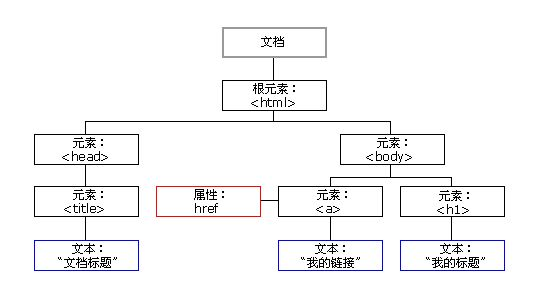

+ 文档：一个页面就是一个文档，DOM 中使用 document 表示
+ 元素：页面中的所有标签都是元素，DOM 中使用 element 表示
+ 节点：网页中的所有内容都是节点（标签、属性、文本、注释等），DOM 中使用 node 表示
  **DOM 把以上内容都看做是对象**

### 获取元素

获取页面中的元素可以使用以下几种方式:

+ 根据 ID 获取

+ 根据标签名获取

+ 通过 HTML5 新增的方法获取 

+ 特殊元素获取


#### 根据 ID 获取

使用 getElementById() 方法可以获取带有 ID 的元素对象。

~~~ javascript
document.getElementById('id');
~~~

使用 console.dir() 可以打印我们获取的元素对象，更好的查看对象里面的属性和方法。


#### 根据标签名获取

使用 getElementsByTagName() 方法可以返回带有指定标签名的对象的集合。

~~~javascript
document.getElementsByTagName('标签名');
~~~

注意：
1. 因为得到的是一个对象的集合，所以我们想要操作里面的元素就需要遍历。
2. 得到元素对象是动态的


#### 通过 HTML5 新增的方法获取

~~~javascript
1. document.getElementsByClassName(‘类名’)；// 根据类名返回元素对象集合
~~~

~~~javascript
2. document.querySelector('选择器'); // 根据指定选择器返回第一个元素对象
~~~

~~~javascript
3. document.querySelectorAll('选择器'); // 根据指定选择器返回
~~~

注意：
querySelector 和 querySelectorAll里面的选择器需要加符号,比如:document.querySelector('#nav');

#### 获取特殊元素（body，html）

获取body元素

~~~javascript
1. doucumnet.body // 返回body元素对象
~~~

获取html元素

~~~javascript
1. document.documentElement // 返回html元素对象
~~~


### 事件基础

JavaScript 使我们有能力创建动态页面，而事件是可以被 JavaScript 侦测到的行为。
简单理解： 触发--- 响应机制。
网页中的每个元素都可以产生某些可以触发 JavaScript 的事件，例如，我们可以在用户点击某按钮时产生一个
事件，然后去执行某些操作。

#### **事件三要素**

1. 事件源 （谁）
2. 事件类型 （什么事件）
3. 事件处理程序 （做啥）

#### **执行事件的步骤**

1. 获取事件源
2. 注册事件（绑定事件）
3. 添加事件处理程序（采取函数赋值形式）

#### **常见的鼠标事件**

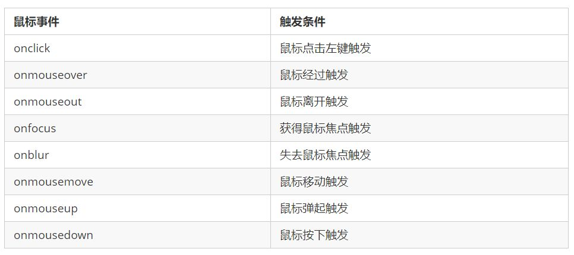


### 操作元素

JavaScript 的 DOM 操作可以改变网页内容、结构和样式，我们可以利用 DOM 操作元素来改变元素里面的内
容 、属性等。注意以下都是属性

#### 改变元素内容

~~~javascript
element.innerText
~~~

从起始位置到终止位置的内容, 但它去除 html 标签， 同时空格和换行也会去掉

~~~javascript
element.innerHTML
~~~

起始位置到终止位置的全部内容，包括 html 标签,可增加标签，同时保留空格和换行

#### 常用元素的属性操作

1. innerText、innerHTML 改变元素内容
2. src、href
3. id、alt、title

#### 表单元素的属性操作

利用 DOM 可以操作如下表单元素的属性：
type、value、checked、selected、disabled


#### 样式属性操作

我们可以通过 JS 修改元素的大小、颜色、位置等样式。

1. element.style 行内样式操作
2. element.className 类名样式操作

注意：

1. 如果样式修改较多，可以采取操作类名方式更改元素样式。
2. class因为是个保留字，因此使用className来操作元素类名属性
3. className 会直接更改元素的类名，会覆盖原先的类名。


### 总结

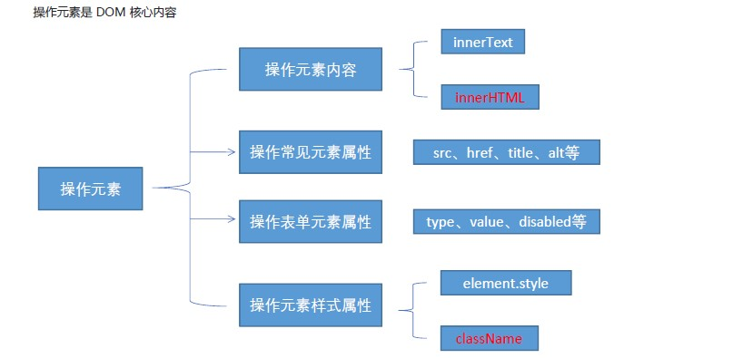


 ### 排他思想

如果有同一组元素，我们想要某一个元素实现某种样式， 需要用到循环的排他思想算法：
1. 所有元素全部清除样式（干掉其他人）
2. 给当前元素设置样式 （留下我自己）
3. 注意顺序不能颠倒，首先干掉其他人，再设置自己


### 自定义属性的操作

#### 获取属性值

+ element.属性 获取属性值。
+ element.getAttribute('属性');

区别：

+ element.属性 获取内置属性值（元素本身自带的属性）

+ element.getAttribute(‘属性’); 主要获得自定义的属性 （标准） 我们程序员自定义的属性

#### 设置属性值

+ element.属性 = ‘值’ 设置内置属性值。
+  element.setAttribute('属性', '值');

区别：

+ element.属性 设置内置属性值
+  element.setAttribute(‘属性’); 主要设置自定义的属性 （标准）

#### 移除属性

+ element.removeAttribute('属性');


###  H5自定义属性

自定义属性目的：是为了保存并使用数据。有些数据可以保存到页面中而不用保存到数据库中。
自定义属性获取是通过getAttribute(‘属性’) 获取。
但是有些自定义属性很容易引起歧义，不容易判断是元素的内置属性还是自定义属性。
H5给我们新增了自定义属性：

#### 设置H5自定义属性

H5规定自定义属性data-开头做为属性名并且赋值。
比如 <div data-index="1"></div>
或者使用 JS 设置
element.setAttribute(‘data-index’, 2)


#### 获取H5自定义属性

1. 兼容性获取 element.getAttribute(‘data-index’);
2. H5新增 element.dataset.index 或者 element.dataset[‘index’]            ie 11才开始支持


### 节点操作

为什么学节点操作

1. 利用 DOM 提供的方法获取元素
+ document.getElementById()
+ document.getElementsByTagName()
+  document.querySelector 等
+  逻辑性不强、繁琐

2. 利用节点层级关系获取元素

+ 利用父子兄节点关系获取元素
+  逻辑性强， 但是兼容性稍差

这两种方式都可以获取元素节点，我们后面都会使用，但是节点操作更简单

#### 节点概述

网页中的所有内容都是节点（标签、属性、文本、注释等），在DOM 中，节点使用 node 来表示。
HTML DOM 树中的所有节点均可通过 JavaScript 进行访问，所有 HTML 元素（节点）均可被修改，也可以
创建或删除。

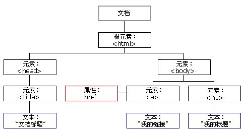   

一般地，节点至少拥有**nodeType（节点类型）**、**nodeName（节点名称）**和**nodeValue（节点值）**这三个
基本属性。

+ 元素节点 nodeType 为 1
+ 属性节点 nodeType 为 2
+  文本节点 nodeType 为 3 （文本节点包含文字、空格、换行等）
  我们在

开发中，节点操作主要操作的是元素节点


#### 节点层级

利用 DOM 树可以把节点划分为不同的层级关系，常见的是父子兄层级关系。


##### 父级节点

~~~javascript
node.parentNode
~~~

+ parentNode 属性可返回某节点的父节点，注意是最近的一个父节点
+ 如果指定的节点没有父节点则返回 null

##### 子节点

~~~javascript
1. parentNode.childNodes（标准）
~~~

parentNode.childNodes 返回包含指定节点的子节点的集合，该集合为即时更新的集合。
**注意：返回值里面包含了所有的子节点，包括元素节点，文本节点等。**
**如果只想要获得里面的元素节点，则需要专门处理。 所以我们一般不提倡使用childNodes**

~~~javascript
var ul = document. querySelector(‘ul’);
for(var i = 0; i < ul.childNodes.length;i++) {
if (ul.childNodes[i].nodeType == 1) {
// ul.childNodes[i] 是元素节点
console.log(ul.childNodes[i]);
}
}
~~~


~~~javascript
2. parentNode.children（非标准）
~~~

parentNode.children 是一个只读属性，返回所有的子元素节点。它**只返回子元素节点**，其余节点不返
回 （要重点掌握）。
虽然children 是一个非标准，但是得到了各个浏览器的支持，因此可以放心使用


~~~javascript
3. parentNode.firstChild
~~~

firstChild 返回第一个子节点，找不到则返回null。同样，也是包含**所有的节点。**


~~~javascript
4. parentNode.lastChild
~~~

lastChild 返回最后一个子节点，找不到则返回null。同样，也是包含**所有的节点。**


~~~javascript
5. parentNode.firstElementChild
~~~

firstElementChild 返回第一个子元素节点，找不到则返回null。


~~~javascript
6. parentNode.lastElementChild
~~~

lastElementChild 返回最后一个子元素节点，找不到则返回null。

**注意：这5.6两个方法有兼容性问题，IE9 以上才支持。**


实际开发中，firstChild 和 lastChild 包含其他节点，操作不方便，而 firstElementChild 和
lastElementChild 又有兼容性问题，那么我们如何获取第一个子元素节点或最后一个子元素节点呢？

**解决方案：**

1. **如果想要第一个子元素节点，可以使用**

~~~javascript
 parentNode.chilren[0]
~~~


2. **如果想要最后一个子元素节点，可以使用**

~~~javascript
parentNode.chilren[parentNode.chilren.length - 1]
~~~


##### 兄弟节点

~~~javascript
1. node.nextSibling
~~~

nextSibling 返回当前元素的下一个兄弟元素节点，找不到则返回null。同样，也是包含所有的**节点**。


~~~javascript
2. node.previousSibling
~~~

previousSibling 返回当前元素上一个兄弟元素节点，找不到则返回null。同样，也是包含所有的**节点**。


~~~javascript
3. node.nextElementSibling
~~~

nextElementSibling 返回当前元素下一个兄弟**元素节点**，找不到则返回null。


~~~javascript
4. node.previousElementSibling
~~~

previousElementSibling 返回当前**元素上一个兄弟节点**，找不到则返回null。

**注意：这两个方法有兼容性问题， IE9 以上才支持。**


**解决兼容性问题** 

+ **自己封装一个兼容性的函数**

~~~javascript
function getNextElementSibling(element) {
var el = element;
while (el = el.nextSibling) {
if (el.nodeType === 1) {
return el;
}
}
return null;
}
~~~


#### 创建节点

~~~javascript
document.createElement('tagName')
~~~

document.createElement() 方法创建由 tagName 指定的 HTML 元素。因为这些元素原先不存在，
是根据我们的需求动态生成的，所以我们也称为动态创建元素节点。

#### 添加节点

~~~javascript
1.node.appendChild(child)
~~~

node.appendChild() 方法将一个节点添加到指定父节点的子节点列表末尾。类似于 CSS 里面的
after 伪元素。

~~~javascript
2.node.insertBefore(child, 指定元素)
~~~

node.insertBefore() 方法将一个节点添加到父节点的指定子节点前面。类似于 CSS 里面的 before伪元素。

#### 删除节点

~~~javascript
node.removeChild(child)
~~~

node.removeChild() 方法从 DOM 中删除一个子节点，返回删除的节点。


#### 复制节点(克隆节点)

~~~javascript
node.cloneNode()
~~~

node.cloneNode() 方法返回调用该方法的节点的一个副本。 也称为克隆节点/拷贝节点。

注意：
1. 如果括号参数为空或者为 false ，则是浅拷贝，即只克隆复制节点本身，不克隆里面的子节点。
2. 如果括号参数为 true ，则是深度拷贝，会复制节点本身以及里面所有的子节点。


### 三种动态创建元素区别

+ document.write()
+ element.innerHTML
+  document.createElement()

**区别**

1. document.write 是直接将内容写入页面的内容流，但是文档流执行完毕，则它会导致页面全部重绘

2. innerHTML 是将内容写入某个 DOM 节点，不会导致页面全部重绘

3. innerHTML 创建多个元素效率更高（不要拼接字符串，采取数组形式拼接），结构稍微复杂

4. createElement() 创建多个元素效率稍低一点点，但是结构更清晰

  

  总结：不同浏览器下，innerHTML 效率要比 creatElement 高


### DOM 重点核心

**文档对象模型**（Document Object Model，简称 DOM），是 W3C 组织推荐的处理可扩展标记语言
（HTML或者XML）的标准编程接口。
W3C 已经定义了一系列的 DOM 接口，通过这些 DOM 接口可以改变网页的内容、结构和样式。

1. 对于JavaScript，为了能够使JavaScript操作HTML，JavaScript就有了一套自己的dom编程接口。
2. 对于HTML，dom使得html形成一棵dom树. 包含 文档、元素、节点


我们获取过来的DOM元素是一个对象（object），所以称为**文档对象模型**


关于dom操作，我们主要针对于元素的操作。主要有创建、增、删、改、查、属性操作、事件操作。

#### 创建

1. document.write
2. innerHTML
3. createElement

#### 增

1. appendChild
2. insertBefore

#### 删

1. removeChild

#### 改

主要修改dom的元素属性，dom元素的内容、属性, 表单的值等

1. 修改元素属性： src、href、title等
2. 修改普通元素内容： innerHTML 、innerText
3. 修改表单元素： value、type、disabled等
4. 修改元素样式： style、className

#### 查

主要获取查询dom的元素

1. DOM提供的API 方法： getElementById、getElementsByTagName 古老用法 不太推荐
2. H5提供的新方法： querySelector、querySelectorAll 提倡
3. 利用节点操作获取元素： 父(parentNode)、子(children)、兄(previousElementSibling、
nextElementSibling) 提倡

#### 属性操作

主要针对于自定义属性。

1. setAttribute：设置dom的属性值
2. getAttribute：得到dom的属性值
3. removeAttribute移除属性

#### 事件操作

给元素注册事件， 采取 事件源.事件类型 = 事件处理程序


## 事件高级


### 注册事件（绑定事件）

#### 注册事件概述

给元素添加事件，称为注册事件或者绑定事件。

##### 注册事件的两种方式

传统方式和方法监听注册方式

###### 传统注册方式方法

+ 利用 on 开头的事件 onclick
+  <button onclick=“alert('hi~')”></button>
+  btn.onclick = function() {}
+  特点： 注册事件的唯一性
+  同一个元素同一个事件只能设置一个处理函数，最
  后注册的处理函数将会**覆盖**前面注册的处理函数

###### 方法监听注册方式

+ w3c 标准 推荐方式
+ addEventListener() 它是一个方法
+  IE9 之前的 IE 不支持此方法，可使用 attachEvent() 代替
+  特点：同一个元素同一个事件可以注册多个监听器
+  按注册顺序依次执行


#### addEventListener 事件监听方式

~~~javascript
eventTarget.addEventListener(type, listener[, useCapture])
~~~

eventTarget.addEventListener()方法将指定的监听器注册到 eventTarget（目标对象）上，当该对
象触发指定的事件时，就会执行事件处理函数。
该方法接收三个参数：

+ type：事件类型字符串，比如 click 、mouseover ，注意这里不要带 on
+  listener：事件处理函数，事件发生时，会调用该监听函数
+  useCapture：可选参数，是一个布尔值，默认是 false。学完 DOM 事件流后，我们再进一步学习


#### attachEvent 事件监听方式

~~~javascript
eventTarget.attachEvent(eventNameWithOn, callback)
~~~


eventTarget.attachEvent()方法将指定的监听器注册到 eventTarget（目标对象） 上，当该对象触
发指定的事件时，指定的回调函数就会被执行。
该方法接收两个参数：

+ eventNameWithOn：事件类型字符串，比如 onclick 、onmouseover ，这里要带 on

+  callback： 事件处理函数，当目标触发事件时回调函数被调用

  注意：IE8 及早期版本支持


#### 注册事件兼容性解决方案

~~~javascript
function addEventListener(element, eventName, fn) {
// 判断当前浏览器是否支持 addEventListener 方法
if (element.addEventListener) {
element.addEventListener(eventName, fn); // 第三个参数 默认是false
} else if (element.attachEvent) {
element.attachEvent('on' + eventName, fn);
} else {
// 相当于 element.onclick = fn;
element['on' + eventName] = fn;
}
~~~

**兼容性处理的原则： 首先照顾大多数浏览器，再处理特殊浏览器**


### 删除事件（解绑事件）

#### 删除事件的方式

1. 传统注册方式

+ eventTarget.onclick = null;

1. 方法监听注册方式
    ① eventTarget.removeEventListener(type, listener[, useCapture]); //对应addEventListener
    ② eventTarget.detachEvent(eventNameWithOn, callback);  //对应attachEvent 

#### 删除事件兼容性解决方案

~~~javascript
function removeEventListener(element, eventName, fn) {
// 判断当前浏览器是否支持 removeEventListener 方法
if (element.removeEventListener) {
element.removeEventListener(eventName, fn); // 第三个参数 默认是false
} else if (element.detachEvent) {
element.detachEvent('on' + eventName, fn);
} else {
element['on' + eventName] = null;
}
~~~


### DOM 事件流

事件流描述的是从页面中接收事件的顺序。
事件发生时会在元素节点之间按照特定的顺序传播，这个传播过程即 DOM 事件流。
比如我们给一个div 注册了点击事件：

DOM 事件流分为3个阶段：
1. 捕获阶段
2. 当前目标阶段
3. 冒泡阶段

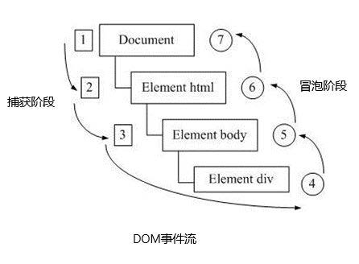

+ 事件冒泡： IE 最早提出，事件开始时由最具体的元素接收，然后逐级向上传播到到 DOM 最顶层节点的过程。
+  事件捕获： 网景最早提出，由 DOM 最顶层节点开始，然后逐级向下传播到到最具体的元素接收的过程。


我们向水里面扔一块石头，首先它会有一个下降的过程，这个过程就可以理解为从最顶层向事件发生的最具
体元素（目标点）的捕获过程；之后会产生泡泡，会在最低点（ 最具体元素）之后漂浮到水面上，这个过
程相当于事件冒泡。

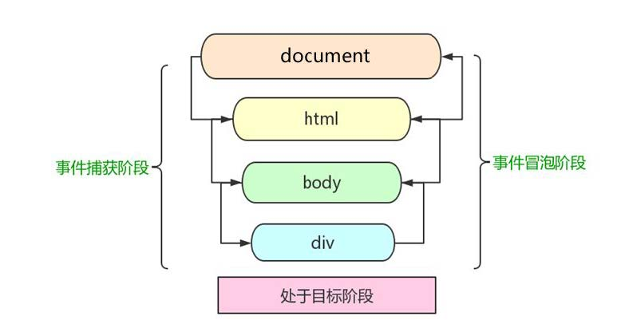


事件发生时会在元素节点之间按照特定的顺序传播，这个传播过程即 DOM 事件流。

注意
1. JS 代码中只能执行捕获或者冒泡其中的一个阶段。
2. onclick 和 attachEvent 只能得到冒泡阶段。
3. addEventListener(type, listener[, useCapture])第三个参数如果是 true，表示在事件捕
获阶段调用事件处理程序；如果是 false（不写默认就是false），表示在事件冒泡阶段调用事件处理
程序。
4. 实际开发中我们很少使用事件捕获，我们更关注事件冒泡。
5. 有些事件是没有冒泡的，比如 onblur、onfocus、onmouseenter、onmouseleave
6. 事件冒泡有时候会带来麻烦，有时候又会帮助很巧妙的做某些事件。


### 事件对象


#### 什么是事件对象

~~~javascript
eventTarget.onclick = function(event) {}
eventTarget.addEventListener('click', function(event) {}）
// 这个 event 就是事件对象，我们还喜欢的写成 e 或者 evt
~~~

官方解释：event 对象代表事件的状态，比如键盘按键的状态、鼠标的位置、鼠标按钮的状态。
简单理解：事件发生后，跟事件相关的一系列信息数据的集合都放到这个对象里面，这个对象就是事件对象
event，它有很多属性和方法。
比如：

1. 谁绑定了这个事件。
2. 鼠标触发事件的话，会得到鼠标的相关信息，如鼠标位置。
3. 键盘触发事件的话，会得到键盘的相关信息，如按了哪个键。


#### 事件对象的使用语法

~~~javascript
eventTarget.onclick = function(event) {
// 这个 event 就是事件对象，我们还喜欢的写成 e 或者 evt
}
eventTarget.addEventListener('click', function(event) {
// 这个 event 就是事件对象，我们还喜欢的写成 e 或者 evt
}）
~~~

这个 event 是个形参，系统帮我们设定为事件对象，不需要传递实参过去。
当我们注册事件时， event 对象就会被系统自动创建，并依次传递给事件监听器（事件处理函数）。


#### 事件对象的兼容性方案

事件对象本身的获取存在兼容问题：
1. 标准浏览器中是浏览器给方法传递的参数，只需要定义形参 e 就可以获取到。

2. 在 IE6~8 中，浏览器不会给方法传递参数，如果需要的话，需要到 window.event 中获取查找。

  

  **解决:**
  **e = e || window.event;**


#### 事件对象的常见属性和方法

**e.target 和 this 的区别：**
**this 是事件绑定的元素， 这个函数的调用者（绑定这个事件的元素）**
**e.target 是事件触发的元素。**

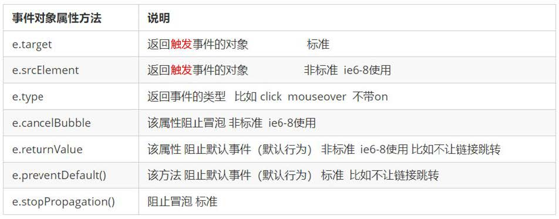


### 阻止默认行为

例：阻止链接跳转


### 阻止事件冒泡


#### 阻止事件冒泡的两种方式

事件冒泡：开始时由最具体的元素接收，然后逐级向上传播到到 DOM 最顶层节点。
事件冒泡本身的特性，会带来的坏处，也会带来的好处，需要我们灵活掌握。


**阻止事件冒泡**

+ 标准写法：利用事件对象里面的 stopPropagation()方法

+ + ~~~javascript
    e.stopPropagation()
    ~~~

  

+  非标准写法：IE 6-8 利用事件对象 cancelBubble 属性

+ + ~~~javascript
    e.cancelBubble = true;
    ~~~

    

**阻止事件冒泡的兼容性解决方案**

~~~javascript
if(e && e.stopPropagation){
e.stopPropagation();
}else{
window.event.cancelBubble = true;
}
~~~


### 事件委托（代理、委派）

事件冒泡本身的特性，会带来的坏处，也会带来的好处，需要我们灵活掌握。生活中有如下场景：
咱们班有100个学生， 快递员有100个快递， 如果一个个的送花费时间较长。同时每个学生领取的时候，也需
要排队领取，也花费时间较长，何如？
**解决方案：** 快递员把100个快递，委托给班主任，班主任把这些快递放到办公室，同学们下课自行领取即可。
**优势：** 快递员省事，委托给班主任就可以走了。 同学们领取也方便，因为相信班主任。


事件冒泡本身的特性，会带来的坏处，也会带来的好处，需要我们灵活掌握。程序中也有如此场景：

~~~html
<ul>
<li>111</li>
<li>111</li>
<li>111</li>
<li>111</li>
<li>111</li>
</ul>
~~~

点击每个 li 都会弹出对话框，以前需要给每个 li 注册事件，是非常辛苦的，而且访问 DOM 的次数越多，这就
会延长整个页面的交互就绪时间。


#### 事件委托

事件委托也称为事件代理， 在 jQuery 里面称为事件委派。

#### 事件委托的原理

**不是每个子节点单独设置事件监听器，而是事件监听器设置在其父节点上，然后利用冒泡原理影响设置每个子节点。**
以上案例：给 ul 注册点击事件，然后利用事件对象的 target 来找到当前点击的 li，因为点击 li，事件会冒泡到 ul 上，
ul 有注册事件，就会触发事件监听器。

#### 事件委托的作用

我们只操作了一次 DOM ，提高了程序的性能。


### 常用的鼠标事件

#### 常用的鼠标事件


1.禁止鼠标右键菜单
contextmenu主要控制应该何时显示上下文菜单，主要用于程序员取消默认的上下文菜单

~~~javascript
document.addEventListener('contextmenu', function(e) {
e.preventDefault();
})
~~~


2.禁止鼠标选中（selectstart 开始选中）

~~~javascript
document.addEventListener('selectstart', function(e) {
e.preventDefault();
})
~~~


#### 鼠标事件对象

event对象代表事件的状态，跟事件相关的一系列信息的集合。现阶段我们主要是用鼠标事件对象
MouseEvent 和键盘事件对象 KeyboardEvent。

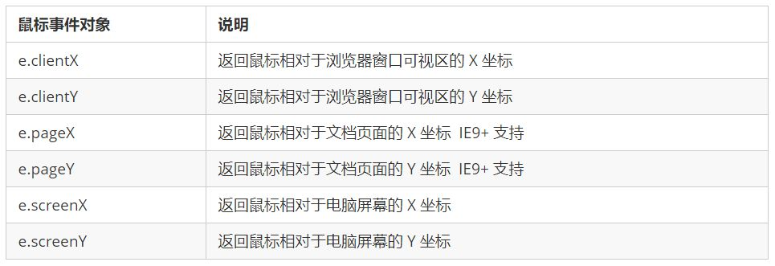


### 常用的键盘事件

#### 常用的键盘事件

事件除了使用鼠标触发，还可以使用键盘触发。

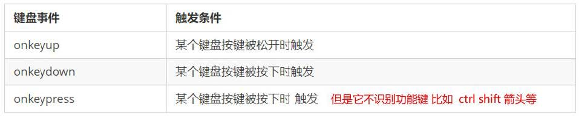

**注意：**
1. **如果使用addEventListener 不需要加 on**
2. **onkeypress 和前面2个的区别是，它不识别功能键，比如左右箭头，shift 等。**
3. **三个事件的执行顺序是： keydown -- keypress --- keyup**


#### 键盘事件对象

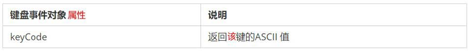

**注意： onkeydown 和 onkeyup 不区分字母大小写，onkeypress 区分字母大小写。**
**在我们实际开发中，我们更多的使用keydown和keyup， 它能识别所有的键（包括功能键）**
**Keypress 不识别功能键，但是keyCode属性能区分大小写，返回不同的ASCII值**


#### ASCII 表

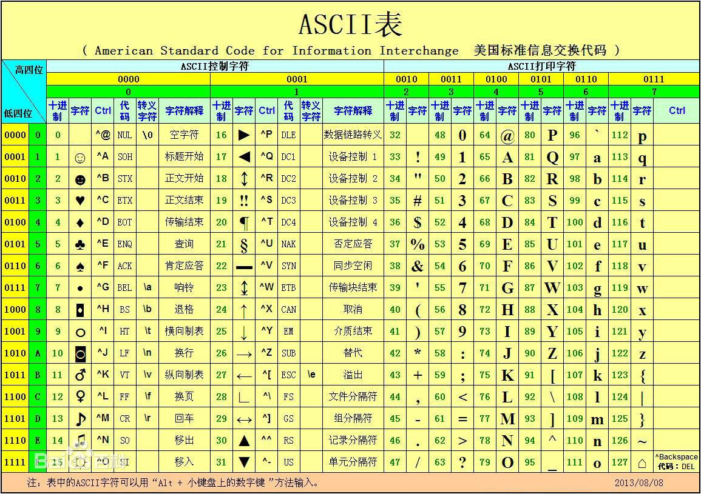


## BOM

### BOM 概述

#### 什么是BOM

BOM（Browser Object Model）即**浏览器对象模型**，它提供了独立于内容而与浏览器窗口进行交互的对象，其核心
对象是 window。
BOM 由一系列相关的对象构成，并且每个对象都提供了很多方法与属性。
BOM 缺乏标准，JavaScript 语法的标准化组织是 ECMA，DOM 的标准化组织是 W3C，BOM 最初是Netscape 浏
览器标准的一部分。

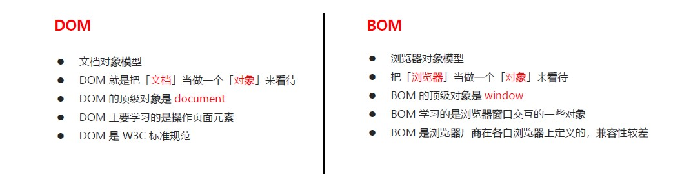


#### BOM 的构成

BOM 比 DOM 更大，它包含 DOM。

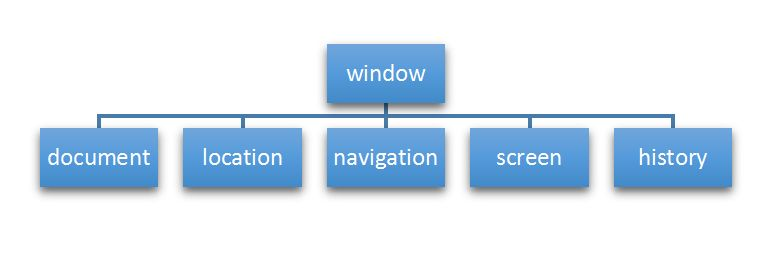

window 对象是浏览器的顶级对象，它具有双重角色。
1. 它是 JS 访问浏览器窗口的一个接口。
2. 它是一个全局对象。定义在全局作用域中的变量、函数都会变成 window 对象的属性和方法。
在调用的时候可以省略 window，前面学习的对话框都属于 window 对象方法，如 alert()、prompt() 等。
**注意：window下的一个特殊属性 window.name**


### window 对象的常见事件
#### 窗口加载事件
~~~ javascript
window.onload = function(){}
或者
window.addEventListener("load",function(){});
~~~

window.onload 是窗口 (页面）加载事件,当文档内容完全加载完成会触发该事件(包括图像、脚本文件、CSS
文件等), 就调用的处理函数。
注意：
1. 有了 window.onload 就可以把 JS 代码写到页面元素的上方，因为 onload 是等页面内容全部加载完毕，
再去执行处理函数。
2. window.onload 传统注册事件方式 只能写一次，如果有多个，会以最后一个 window.onload 为准。
3. 如果使用 addEventListener 则没有限制


~~~javascript
document.addEventListener('DOMContentLoaded',function(){})
~~~

DOMContentLoaded 事件触发时，仅当DOM加载完成，不包括样式表，图片，flash等等。
Ie9以上才支持
如果页面的图片很多的话, 从用户访问到onload触发可能需要较长的时间, 交互效果就不能实现，必然影响用户的体验，此时用 DOMContentLoaded 事件比较合适。


#### 调整窗口大小事件

~~~javascript
window.onresize = function(){}
window.addEventListener("resize",function(){});
~~~

window.onresize 是调整窗口大小加载事件, 当触发时就调用的处理函数。
注意：
1. 只要窗口大小发生像素变化，就会触发这个事件。
2. 我们经常利用这个事件完成响应式布局。 window.innerWidth 当前屏幕的宽度


### 定时器

#### 两种定时器

window 对象给我们提供了 2 个非常好用的方法-定时器。

+ setTimeout()
+ setInterval()


#### setTimeout() 定时器

~~~javascript
window.setTimeout(调用函数, [延迟的毫秒数]);
~~~

setTimeout() 方法用于设置一个定时器，该定时器在定时器到期后执行调用函数。
注意：

1. window 可以省略。
2. 这个调用函数可以直接写函数，或者写函数名或者采取字符串‘函数名()'三种形式。第三种不推荐
3. 延迟的毫秒数省略默认是 0，如果写，必须是毫秒。
4. 因为定时器可能有很多，所以我们经常给定时器赋值一个标识符。


**setTimeout() 这个调用函数也称为回调函数 callback**
普通函数是按照代码顺序直接调用。
而这个函数，需要等待时间，时间到了才去调用这个函数，因此称为回调函数。
简单理解： 回调，就是回头调用的意思。上一件事干完，再回头再调用这个函数。
以前我们讲的 element.onclick = function(){} 或者 element.addEventListener(“click”, fn); 里面的 函数也是回调函数。


#### 停止 setTimeout() 定时器

~~~javascript
window.clearTimeout(timeoutID);
~~~

clearTimeout()方法取消了先前通过调用 setTimeout() 建立的定时器。
注意：
1. window 可以省略。
2. 里面的参数就是定时器的标识符 。


#### setInterval() 定时器

~~~javascript
window.setInterval(回调函数, [间隔的毫秒数]);
~~~

setInterval() 方法重复调用一个函数，每隔这个时间，就去调用一次回调函数。
注意：
1. window 可以省略。
2. 这个调用函数可以直接写函数，或者写函数名或者采取字符串 '函数名()' 三种形式。
3. 间隔的毫秒数省略默认是 0，如果写，必须是毫秒，表示每隔多少毫秒就自动调用这个函数。
4.因为定时器可能有很多，所以我们经常给定时器赋值一个标识符。
5. 第一次执行也是间隔毫秒数之后执行，之后每隔毫秒数就执行一次。

#### 停止 setInterval() 定时器

~~~javascript
window.clearInterval(intervalID);
~~~

clearInterval()方法取消了先前通过调用 setInterval()建立的定时器。
注意：
1. window 可以省略。
2. 里面的参数就是定时器的标识符 。


#### this

this的指向在函数定义的时候是确定不了的，只有函数执行的时候才能确定this到底指向谁，一般情况下this
的最终指向的是那个调用它的对象
现阶段，我们先了解一下几个this指向

1. **全局作用域**或者**普通函数**中this指向全局对象window（注意定时器里面的this指向window）
2. **方法调用中谁调用this指向谁**
3. **构造函数中this指向构造函数**的实例


### JS 执行机制


#### JS 是单线程

JavaScript 语言的一大特点就是单线程，也就是说，同一个时间只能做一件事。这是因为 Javascript 这门脚本语言诞生的使命所致——JavaScript 是为处理页面中用户的交互，以及操作 DOM 而诞生的。比如我们对某个 DOM 元素进行添加和删除操作，不能同时进行。 应该先进行添加，之后再删除。

单线程就意味着，所有任务需要排队，前一个任务结束，才会执行后一个任务。这样所导致的问题是： 如果JS 执行的时间过长，这样就会造成页面的渲染不连贯，导致页面渲染加载阻塞的感觉。


#### 同步和异步

为了解决这个问题，利用多核 CPU 的计算能力，HTML5 提出 Web Worker 标准，允许 JavaScript 脚本创建多个线程。于是，JS 中出现了同步和异步。

##### **同步**

前一个任务结束后再执行后一个任务，程序的执行顺序与任务的排列顺序是一致的、同步的。比如做饭的同步做
法：我们要烧水煮饭，等水开了（10分钟之后），再去切菜，炒菜。

##### **异步**

你在做一件事情时，因为这件事情会花费很长时间，在做这件事的同时，你还可以去处理其他事情。比如做饭的异步做法，我们在烧水的同时，利用这10分钟，去切菜，炒菜。
**他们的本质区别： 这条流水线上各个流程的执行顺序不同。**


#### 同步和异步任务

##### **同步任务**

同步任务都在主线程上执行，形成一个执行栈。

##### 异步任务

JS 的异步是通过回调函数实现的。
一般而言，异步任务有以下三种类型:
1、普通事件，如 click、resize 等
2、资源加载，如 load、error 等
3、定时器，包括 setInterval、setTimeout 等
异步任务相关回调函数添加到任务队列中（任务队列也称为消息队列）。

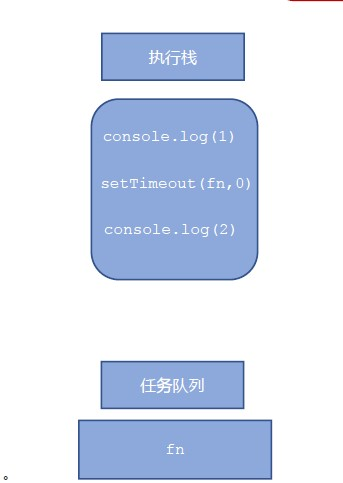

#### JS 执行机制

1. 先执行执行栈中的同步任务。
2. 异步任务（回调函数）放入任务队列中。
3. 一旦执行栈中的所有同步任务执行完毕，系统就会按次序读取任务队列中的异步任务，于是被读取的异步任务结束等待状态，进入执行栈，开始执行。

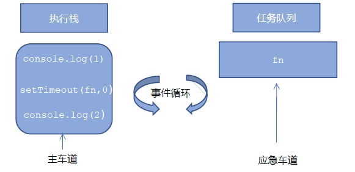


~~~javascript
console.log(1);
document.onclick = function() {
console.log('click');
}
console.log(2);
setTimeout(function() {
console.log(3)
}, 3000)
~~~


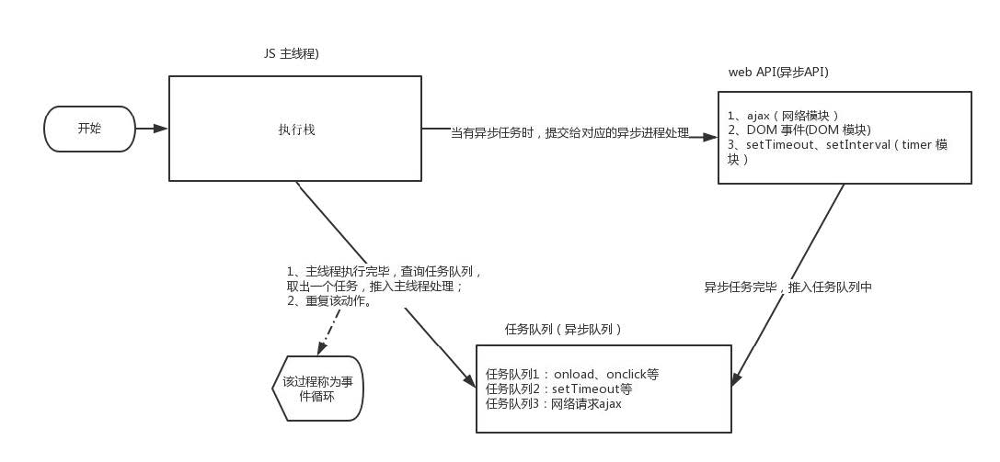

由于主线程不断的重复获得任务、执行任务、再获取任务、再执行，所以这种机制被称为**事件循环（ event loop）**。


### location 对象


#### 什么是location 对象

window 对象给我们提供了一个 location 属性用于获取或设置窗体的 URL，并且可以用于解析 URL 。 因为
这个属性返回的是一个对象，所以我们将这个属性也称为 location 对象。


#### URL

**统一资源定位符 (Uniform Resource Locator, URL)** 是互联网上标准资源的地址。互联网上的每个文件都有一个唯一的 URL，它包含的信息指出文件的位置以及浏览器应该怎么处理它。
URL 的一般语法格式为：

~~~
protocol://host[:port]/path/[?query]#fragment
例
http://www.itcast.cn/index.html?name=andy&age=18#link
~~~

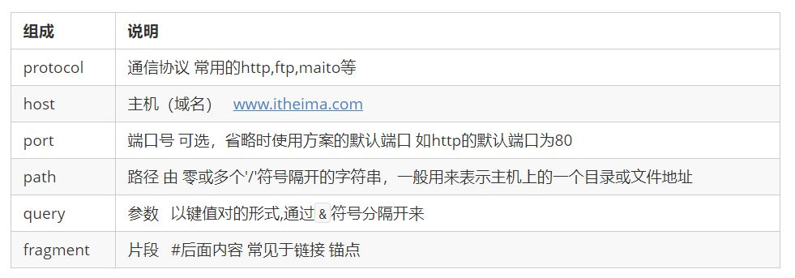


### location 对象的属性

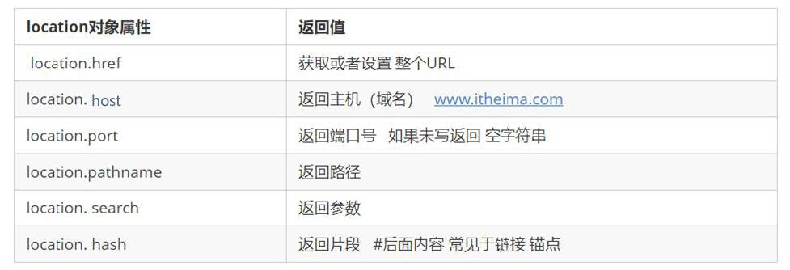

**重点记住： href 和 search**


#### location 对象的方法

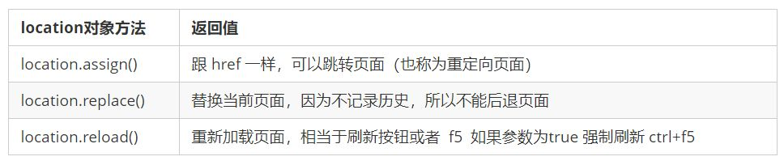


### navigator 对象

navigator 对象包含有关浏览器的信息，它有很多属性，我们最常用的是 userAgent，该属性可以返回由客户机发送服务器的 user-agent 头部的值。
下面前端代码可以判断用户那个终端打开页面，实现跳转

~~~javascript
if((navigator.userAgent.match(/(phone|pad|pod|iPhone|iPod|ios|iPad|Android|
Mobile|BlackBerry|IEMobile|MQQBrowser|JUC|Fennec|wOSBrowser|BrowserNG|WebOS
|Symbian|Windows Phone)/i))) {
window.location.href = ""; //手机
} else {
window.location.href = ""; //电脑
}
~~~


### history 对象

window 对象给我们提供了一个 history 对象，与浏览器历史记录进行交互。该对象包含用户（在浏览器窗口中）
访问过的 URL。

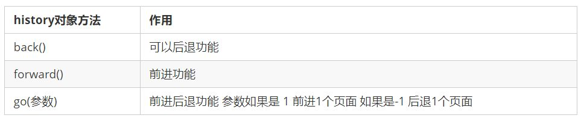

history 对象一般在实际开发中比较少用，但是会在一些 OA 办公系统中见到


## PC端网页特效


### 元素偏移量 offset 系列

#### offset 概述

offset 翻译过来就是偏移量， 我们使用 offset 系列相关属性可以动态的得到该元素的位置（偏移）、大小等。

+ 获得元素距离带有定位父元素的位置
+  获得元素自身的大小（宽度高度）
+  注意： 返回的数值都不带单位

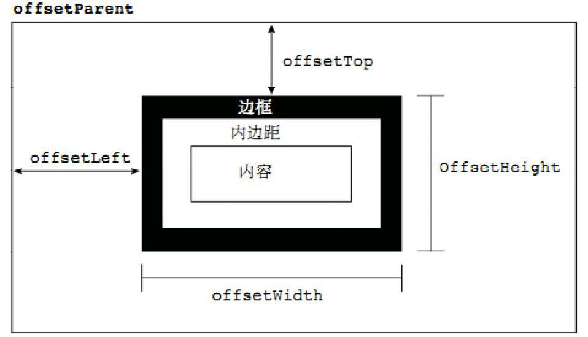

offset 系列常用属性：

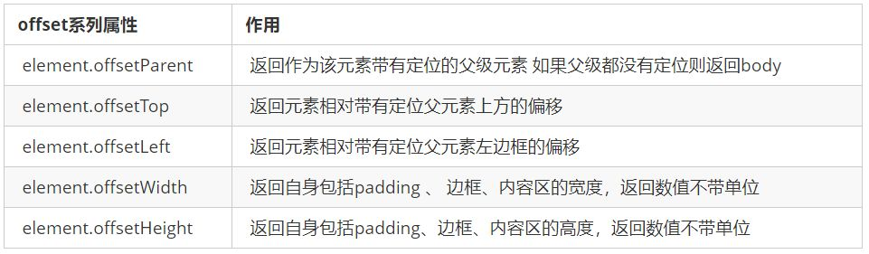


#### offset 与 style 区别

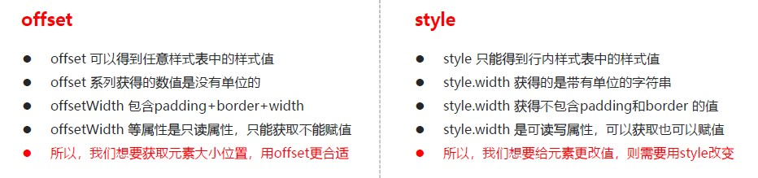


### 元素可视区 client 系列

client 翻译过来就是客户端，我们使用 client 系列的相关属性来获取元素可视区的相关信息。通过 client 系列的相关属性可以动态的得到该元素的边框大小、元素大小等。

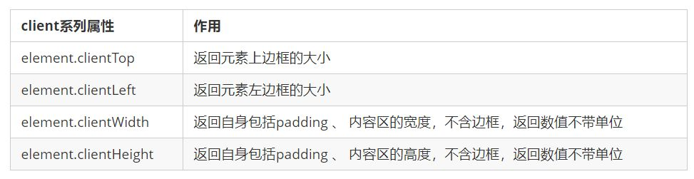

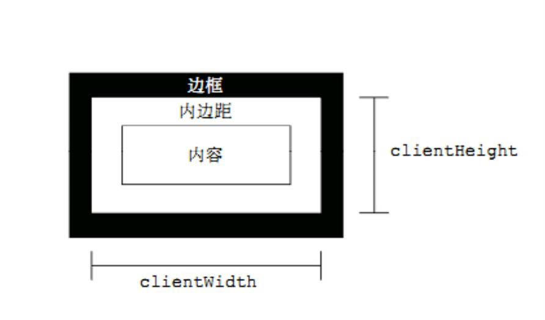


### 元素滚动 scroll 系列

#### 元素 scroll 系列属性

scroll 翻译过来就是滚动的，我们使用 scroll 系列的相关属性可以动态的得到该元素的大小、滚动距离等。

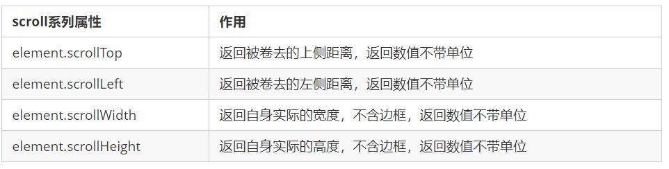

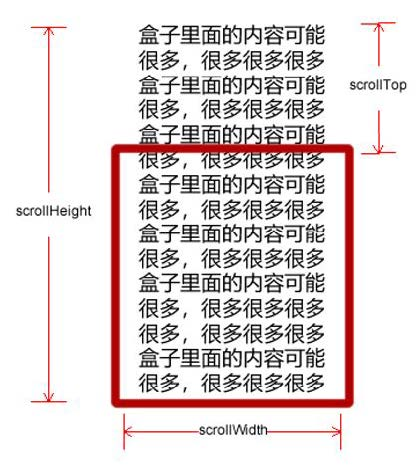


#### 页面被卷去的头部

如果浏览器的高（或宽）度不足以显示整个页面时，会自动出现滚动条。当滚动条向下滚动时，页面上面被隐藏
掉的高度，我们就称为页面被卷去的头部。滚动条在滚动时会触发 onscroll 事件。


#### 页面被卷去的头部兼容性解决方案

需要注意的是，页面被卷去的头部，有兼容性问题，因此被卷去的头部通常有如下几种写法：
1. 声明了 DTD，使用 document.documentElement.scrollTop
2. 未声明 DTD，使用 document.body.scrollTop
3. 新方法 window.pageYOffset 和 window.pageXOffset，IE9 开始支持

~~~
function getScroll() {
return {
left: window.pageXOffset || document.documentElement.scrollLeft || document.body.scrollLeft||0,
top: window.pageYOffset || document.documentElement.scrollTop || document.body.scrollTop || 0
};
}
使用的时候 getScroll().left
~~~


### 三大系列总结

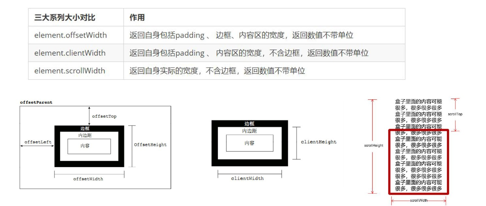

他们主要用法：
1. offset系列 经常用于获得元素位置 offsetLeft offsetTop
2. client 经常用于获取元素大小 clientWidth clientHeight
3. scroll 经常用于获取滚动距离 scrollTop scrollLeft
4. 注意页面滚动的距离通过 window.pageXOffset 获得


### mouseenter 和mouseover的区别

mouseenter 鼠标事件

+ 当鼠标移动到元素上时就会触发 mouseenter 事件
+  类似 mouseover，它们两者之间的差别是    **mouseover 鼠标经过自身盒子会触发，经过子盒子还会触发。 mouseenter 只会经过自身盒子触发**   之所以这样，就是因为mouseenter不会冒泡
+  跟mouseenter搭配 鼠标离开 mouseleave 同样不会冒泡


### 动画函数封装

#### 动画实现原理

**核心原理：**通过定时器 setInterval() 不断移动盒子位置。

实现步骤：
1. 获得盒子当前位置
2. 让盒子在当前位置加上1个移动距离
3. 利用定时器不断重复这个操作
4. 加一个结束定时器的条件
5. 注意此元素需要添加定位，才能使用element.style.left


#### 动画函数简单封装

注意函数需要传递2个参数，动画对象和移动到的距离。


#### 动画函数给不同元素记录不同定时器

如果多个元素都使用这个动画函数，每次都要var 声明定时器。我们可以给不同的元素使用不同的定时器（自己专门用自己的定时器）。
核心原理：利用 JS 是一门动态语言，可以很方便的给当前对象添加属性。


#### 缓动效果原理

缓动动画就是让元素运动速度有所变化，最常见的是让速度慢慢停下来
思路：
1. 让盒子每次移动的距离慢慢变小，速度就会慢慢落下来。
2. 核心算法： (目标值 - 现在的位置 ) / 10 做为每次移动的距离 步长
3. 停止的条件是： 让当前盒子位置等于目标位置就停止定时器
4. 注意步长值需要取整


#### 动画函数多个目标值之间移动

可以让动画函数从 800 移动到 500。
当我们点击按钮时候，判断步长是正值还是负值
1. 如果是正值，则步长 往大了取整
2. 如果是负值，则步长 向小了取整


#### 动画函数添加回调函数

**回调函数原理：**函数可以作为一个参数。将这个函数作为参数传到另一个函数里面，当那个函数执行完之后，
再执行传进去的这个函数，这个过程就叫做**回调**。
回调函数写的位置：定时器结束的位置。


#### 动画函数封装到单独JS文件里面

因为以后经常使用这个动画函数，可以单独封装到一个JS文件里面，使用的时候引用这个JS文件即可。
1. 单独新建一个JS文件。
2. HTML文件引入 JS 文件。


### 常见网页特效案例

#### 节流阀

防止轮播图按钮连续点击造成播放过快。
节流阀目的：当上一个函数动画内容执行完毕，再去执行下一个函数动画，让事件无法连续触发。
核心实现思路：利用回调函数，添加一个变量来控制，锁住函数和解锁函数。
开始设置一个变量 var flag = true;
If(flag) {flag = false; do something} 关闭水龙头
利用回调函数 动画执行完毕， flag = true 打开水龙头